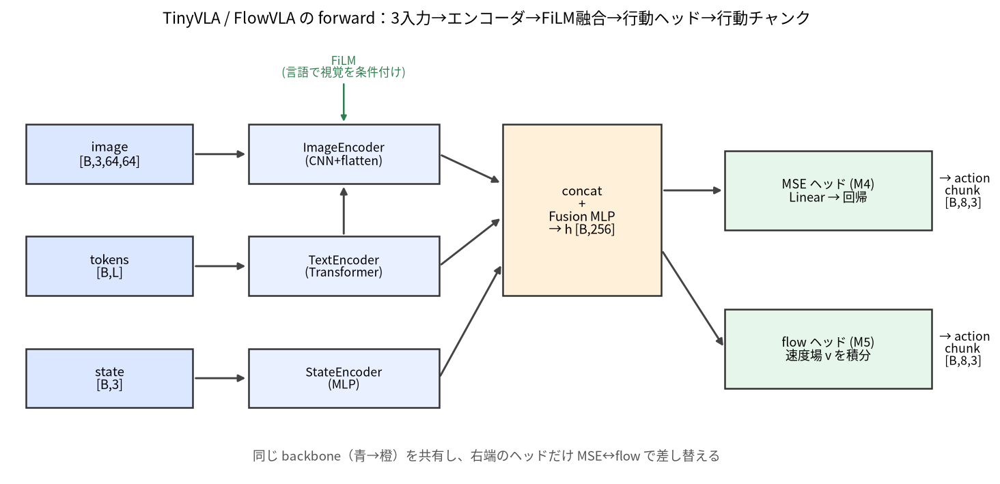
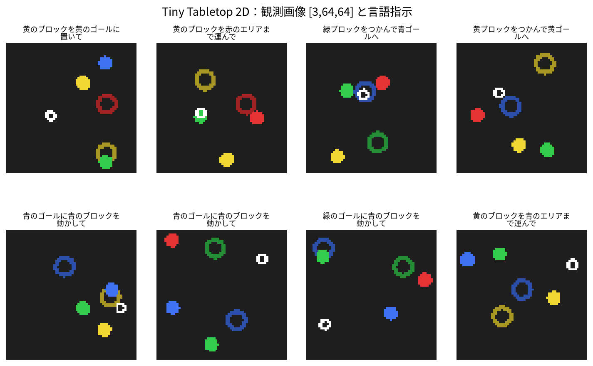

# M0: 全体像とセットアップ

> **この章のゴール**
> - VLA (Vision-Language-Action) が「何を入力に、何を出力するもの」かを一言で言えるようになる。
> - ロボット模倣学習 (imitation learning) の流れと、本教材で繰り返し出てくる用語
>   (action / state / episode / 行動チャンク chunk / 方策 policy) を理解する。
> - 本教材の完成物 **Tiny Tabletop 2D Pick-and-Place** が何をするデモか分かる。
> - 開発環境を用意し、テストと小さな学習が手元で回ることを確認する。
> - M0 → M6 の地図を持って、次に何を学ぶか分かる。
>
> **前提**
> - プログラミングは「関数が書ける」程度で十分です。
> - diffusion / VLM の座学（数式・概念）は知っている前提ですが、M0 では使いません。
> - PyTorch は知らなくて大丈夫です（次の [M1](m1_pytorch.md) でやさしく入門します）。
>
> **所要時間**: 読むのに 30〜40 分 + セットアップ 10〜20 分。

---

## 0.1 VLA とは何か（一文で）

**VLA (Vision-Language-Action) とは、「画像 (Vision) と言語指示 (Language) を入力に取り、ロボットの行動 (Action) を出力するモデル」** です。

```text
   ┌───────────┐     ┌───────────┐     ┌───────────┐
   │  画像      │     │  言語指示  │     │ 状態(任意) │
   │ [3,64,64] │     │「青を青へ」│     │   [3]     │
   └─────┬─────┘     └─────┬─────┘     └─────┬─────┘
         │                 │                 │
         └────────┬────────┴────────┬────────┘
                  ▼                 ▼
            ┌─────────────────────────┐
            │        VLA モデル         │   ← これを自作します
            └────────────┬────────────┘
                         ▼
                  ┌──────────────┐
                  │  行動 action  │   [dx, dy, grip]
                  └──────────────┘
```

ふだん皆さんが知っている画像分類モデルは「画像 → ラベル」を出しました。
VLM は「画像 + テキスト → テキスト」を出しました。
VLA はその出力を **テキストではなく「行動」** に変えたもの、と捉えると分かりやすいです。
「ロボットの目と耳と手をつなぐモデル」だと思ってください。

> **座学とのつながり**: 皆さんが知っている VLM（画像とテキストを融合して表現を作る部分）は、
> VLA の「入力を理解する側」にほぼそのまま流用できます。VLA で新しく必要になるのは、
> その表現から **連続値の行動を生成するヘッド** です。本教材の後半（M5）で、
> 既習の flow matching / 拡散をこの「行動ヘッド」として実装回収します。

---

## 0.2 ロボット模倣学習 (imitation learning) の流れ

本教材は **模倣学習 (imitation learning)**、特に **行動クローニング (behavior cloning)** という最も基本的な方法を使います。
強化学習のように「試行錯誤して報酬を最大化」するのではなく、**「お手本 (expert) の行動をそっくり真似する」** 教師あり学習です。

流れは 4 ステップです。

```text
 [1] お手本を集める      [2] データセットにする    [3] 方策を学習する      [4] 評価する
 ┌──────────────┐      ┌──────────────┐      ┌──────────────┐      ┌──────────────┐
 │ expert が    │      │ (観測, 行動) の │      │ 観測 → 行動 を │      │ 学習した方策を │
 │ タスクを実行 │ ───▶ │ 組をたくさん   │ ───▶ │ NN に回帰で   │ ───▶ │ 環境で動かし  │
 │ → 観測と行動 │      │ 並べる         │      │ 真似させる    │      │ 成功率を測る  │
 │ を記録       │      │ (Dataset)     │      │ (学習ループ)  │      │ (rollout)    │
 └──────────────┘      └──────────────┘      └──────────────┘      └──────────────┘
```

本教材では各ステップを次のように自作します（すべて CPU・物理エンジン不要）。

1. **お手本を集める**: ルールベースの**解析エキスパート** (`expert_action`) がタスクを 100% 成功させ、その軌跡を記録します。ニューラルネットは使いません。世界の状態を直接読めるので毎回成功します。
2. **データセットにする**: 記録した軌跡を `(画像, 状態, 言語, 行動チャンク)` の組に整形します（M3）。
3. **方策を学習する**: VLA に「観測 → お手本の行動」を回帰 (MSE) で真似させます（M4）。さらに flow matching 版（M5）に発展させます。
4. **評価する**: 学習した方策を環境で実際に動かし（**ロールアウト rollout**）、成功率を測ります。

> **用語の整理（最重要）**
>
> | 用語 | 英語 | 本教材での意味 |
> |------|------|----------------|
> | **行動** | action | エージェントが 1 ステップで取る出力。ここでは `[dx, dy, grip_cmd]` の 3 次元。 |
> | **状態** | state | エージェント自身が感じ取れる内部状態（**固有受容感覚 proprioception**）。ここでは `[ax, ay, gripper]` の 3 次元。 |
> | **観測** | observation | モデルへの入力一式。ここでは `画像 + 状態 + 言語指示`。 |
> | **エピソード** | episode | タスク 1 回分の連続した記録（reset から done まで）。`(観測, 行動)` の時系列。 |
> | **方策** | policy | 「観測を入れると行動を返す」関数そのもの。学習する VLA は方策です。 |
> | **行動チャンク** | action chunking | 次の 1 手だけでなく、**未来の数ステップ分の行動をまとめて予測**すること。本教材では 8 ステップ分。 |
> | **ロールアウト** | rollout | 学習した方策を環境で 1 エピソード分、最後まで動かすこと。 |

**行動チャンク (action chunking)** は VLA で頻出の重要概念なので、ここで直感だけ掴んでおきましょう。
1 手ずつ予測すると、予測の小さなブレが毎ステップ積み重なって軌道が崩れがちです。
そこで「今の観測から、未来 8 手をまとめて予測 → そのうち数手だけ実行 → また観測して予測」とすると、軌道が安定します。
SmolVLA や π0 など本物の VLA でも標準的に使われる手法です（詳しくは M3 で実装します）。

---

本教材で自作する VLA の中身（M4/M5 の完成形）はこの形です:



## 0.3 本教材の完成物: Tiny Tabletop 2D Pick-and-Place

最終的にあなたが自作・学習・評価できるようになるのは、次の小さな VLA です。



- **タスク**: 2D 平面（テーブルを真上から見た図）で、**言語指示**に従い、**指定色のブロックを指定色のゴールへ運ぶ** Pick-and-Place（つかんで置く）。
- **指示は日本語**。例: 「青のブロックを青のゴールに置いて」「赤ブロックをつかんで黄ゴールへ」。
- **観測**:
  - `image` … `[3, 64, 64]` の RGB 画像（ブロック・ゴール・グリッパが色付きで描かれる）
  - `state` … `[3]` = `(ax, ay, gripper)`（グリッパの x, y 座標と開閉）
  - `instruction` … 日本語の文字列
- **行動**: `[dx, dy, grip_cmd]`（3 次元）
  - `dx, dy` … グリッパの移動量（ワールド座標の差分、各軸 ±0.08 にクリップ）
  - `grip_cmd` … グリッパ指令（0.0=開く / 1.0=閉じる、>=0.5 で閉と解釈）
- **行動チャンク長**: 8（一度に 8 ステップ分の行動を予測）。

> **簡易化のポイント（正直な注意）**: この環境の「成功」は、**対象ブロックが対象ゴールの半径内に入った時点**で
> 判定します（`Tabletop2DEnv._is_success` は距離だけを見ます）。掴んだまま運べば成功で、実機タスクのように
> 「グリッパを開いて**離す**」ことまでは要求しません。物理エンジンも無く、当たり判定は距離計算だけ——
> 本物の VLA の骨格は保ちつつ、CPU で完結するよう思い切って単純化しています。

画面のイメージ（実際の描画は 64×64 ピクセルの画像です）:

```text
  world 座標 [0,1] x [0,1] を真上から見た図
  ┌───────────────────────────────┐
  │   (R)                          │   (R) 赤ブロック（塗りつぶし円）
  │           ◎                    │   ◎   ゴール（薄いリング, 色付き）
  │                                │   ○   グリッパ開（白いリング）
  │       (B)        ○             │   ●   グリッパ閉（白い塗りつぶし円）
  │                                │
  │   ◎                  (Y)       │   指示:「青のブロックを青のゴールに置いて」
  │                                │   → (B) を上の ◎(青) まで運ぶのが正解
  └───────────────────────────────┘
```

このタスクの良いところは、**実機もシミュレータ（物理エンジン）も要らず、NumPy だけで世界が完結する**ことです。
画像はルールに従って描画され、当たり判定も単純な距離計算です。だから CPU の手元のノート PC だけで、本物の VLA と同じ骨格（画像・言語・状態を融合 → 行動チャンクを生成）を最後まで体験できます。

**2 つの版を作ります。**

| 版 | モデル名 | 行動ヘッド | 学ぶ章 |
|----|----------|------------|--------|
| MSE（回帰）版 | `TinyVLA`（約 0.42M パラメータ） | 全結合で行動を直接回帰、損失は MSE | M4 |
| flow matching 版 | `FlowVLA` | rectified flow で行動を生成（座学の実装回収） | M5 |

> **数値の注意**: 成功率などの数値は乱数・環境差でぶれます。「学習で loss が下がり、成功率が上がる」という**傾向**を見てください。
> 例として、ルールベースの解析エキスパートの成功率は 100%、`TinyVLA` のパラメータ数は約 0.42M（CPU で数分学習可能）です。これらは目安で、皆さんの環境で多少前後します。

---

## 0.4 環境構築

> **重要**: この教材は **CPU だけ・実機なし・物理エンジンなし** で完結します。GPU は不要です。

この教材は、パッケージと仮想環境の管理に **[uv](https://docs.astral.sh/uv/)** を使います。
uv は「速い・1 ツールで完結・`uv.lock` で全員が同じバージョンを再現できる」のが利点で、
`pip` と `venv` を別々に覚えなくても、`uv sync` 一発で環境がそろいます。

### 手順

```bash
# 0) uv を入れる（未導入なら）。入っていればスキップ。
#    macOS / Linux:
curl -LsSf https://astral.sh/uv/install.sh | sh
#    Windows (PowerShell):
#    powershell -c "irm https://astral.sh/uv/install.ps1 | iex"

# 1) リポジトリのルートに移動（このファイルの 2 つ上の階層）
cd vla_learn

# 2) 依存を同期する。これ 1 つで
#    「.venv の作成 → PyTorch(CPU版) の導入 → vla_learn の editable 導入 → pytest 導入」
#    まで全部やってくれる。
uv sync

# 任意) 可視化(matplotlib)も使いたい場合は extra を足す
uv sync --extra viz
```

> **`uv sync` は何をしている?**: カレントの `pyproject.toml` と `uv.lock` を読み、
> ロックされたバージョンで `.venv` を作り直します。本パッケージ `vla_learn` は
> 「編集可能 (editable)」な状態で導入されるので、Python のどこからでも `import vla_learn` が
> 通り、`src/` を書き換えればすぐ反映されます。PyTorch は **CPU 専用 index** から入る設定
> （`pyproject.toml` の `[tool.uv.sources]`）なので、GPU/CUDA は不要・余計な手動 `pip install`
> も不要です。
>
> **`uv run` とは**: `uv run python ...` のように使うと、必要なら環境を自動同期してから実行
> します。`.venv` を手で activate しなくてよいのが便利です（したい場合は
> `source .venv/bin/activate`、Windows は `.venv\Scripts\activate` でも可）。
> どうしても uv を使いたくない場合は、`scripts/` の各ファイル冒頭の `import _bootstrap` が
> `src/` をパスに通すので、`PYTHONPATH=src python scripts/...` 相当でも動きます。

### 動作確認 1: テストが通るか（数十秒）

```bash
uv run pytest -q
```

テストには「環境とエキスパート」「データの shape」「正規化」「モデルの forward」「**1 バッチに過学習できるか**」が含まれます。
最後の「1 バッチに過学習できるか」は、学習機構が健全かを確かめる鉄則のテストで、本教材で繰り返し登場します（M1 で考え方を導入します）。

全部 `passed` と出れば環境は OK です。

### 動作確認 2: 小さく学習が回るか（1 分程度）

```bash
uv run python scripts/train_mse.py --config configs/smoke.json
```

`configs/smoke.json` は **ごく小規模な設定**（60 エピソード・3 epoch）で、「学習ループが最後まで回るか」だけを確かめるためのものです（成功率を競う設定ではありません）。
実体は次のとおりです。

```json
{
  "model_type": "mse",
  "n_episodes": 60,
  "epochs": 3,
  "batch_size": 64,
  "lr": 0.001,
  "eval_episodes": 10,
  "out_dir": "checkpoints/smoke",
  "seed": 0
}
```

エラーなく学習が進み、最後にチェックポイントが `checkpoints/smoke/` に保存されれば、ひととおりの配線（データ生成 → 学習 → 保存）が動いています。
本番の学習・評価コマンド（`configs/m4_mse.json` など）は M4・M5 で扱います。**M0 の段階では重い学習を回す必要はありません。**

> **困ったとき**
> - `ModuleNotFoundError: No module named 'vla_learn'` → `uv sync` を実行したか、コマンドを `uv run` 経由で動かしているか確認。
> - `ModuleNotFoundError: No module named 'torch'` → `uv sync` が未実行か、`uv run` を付け忘れています。
> - `command not found: uv` → uv 自体が未導入です。手順 0 のインストールコマンドを実行してください。
> - スクリプトは `uv run python scripts/...` で動かします（`uv run` が環境を、`import _bootstrap` が `src/` パスを面倒見ます）。

---

## 0.5 リポジトリの歩き方

本文・演習・実装は次のように分かれています。

```text
vla_learn/
├── lessons/        ← 教材本文（M0〜M6, 日本語 Markdown）。いま読んでいるのはここ。
├── exercises/      ← 章ごとの模擬問題（mX/README.md と雛形 .py）
├── solutions/      ← 演習の解答と解説
├── src/vla_learn/  ← 検証済みの実装（envs / datasets / models / training / evaluation）
├── scripts/        ← make_dataset / train_mse / train_flow / eval_policy など
├── configs/        ← 学習設定（m4_mse.json, m5_flow.json, smoke.json）
├── tests/          ← pytest（shape・正規化・forward・1バッチ過学習）
└── docs/           ← 用語集・カリキュラム概要
```

各章は「**本文を読む → 演習 (`exercises/mX/`) を解く → 解答 (`solutions/mX/`) で答え合わせ**」の順で進めます。
演習はどの章も「**shape 確認 → 穴埋め → バグ修正 → 小実装 → 実験**」の 5 型で構成され、毎章「1 バッチに過学習できるか」を確認します。

---

## 0.6 学習マップ（M0 → M6）

| 章 | テーマ | 主に学ぶこと |
|----|--------|--------------|
| **M0**（この章） | 全体像とセットアップ | VLA とは / action・state・episode・chunk / 完成物デモ / 環境構築 |
| [M1](m1_pytorch.md) | PyTorch 速習 | tensor・autograd・`nn.Module`・学習ループ・Dataset/DataLoader |
| [M2](m2_imitation.md) | 最小の模倣学習 | 状態→行動・画像→行動の回帰、なぜ素朴な模倣は崩れるか |
| [M3](m3_data_actions.md) | 行動表現とデータ | 正規化・時間窓・**行動チャンク**・LeRobot 風データ辞書 |
| [M4](m4_tiny_vla_mse.md) | 最小 VLA をスクラッチ | 画像+言語+状態 → 行動チャンク（MSE 版）を自作して学習・評価 |
| [M5](m5_flow_matching.md) | flow matching 化 | 行動ヘッドを生成モデル（rectified flow）へ。座学の実装回収 |
| [M6](m6_lerobot_and_models.md) | LeRobot と有名 VLA | 自作データの LeRobot export / SmolVLA 精読 + π0・GR00T・OpenVLA・MolmoAct 概観 / 卒業課題 |

地図のイメージ:

```text
 M0 全体像        M1 PyTorch        M2 模倣学習       M3 データ
 「VLAとは」  ──▶  「道具を握る」 ──▶  「観測→行動」 ──▶  「行動チャンク」
 環境構築         tensor/学習ループ   崩れる理由        正規化/データ辞書
                                                          │
   ┌──────────────────────────────────────────────────────┘
   ▼
 M4 TinyVLA       M5 FlowVLA        M6 LeRobot & 有名VLA
 「最小VLAを    ──▶  「生成ヘッドに ──▶  「SmolVLA 精読 /
  自作(MSE)」        差し替え(flow)」     自作データを export / 卒業課題」
```

---

## まとめ

- **VLA = 画像 + 言語（+ 状態）→ 行動** を出すモデル。VLM の出力を「行動」に置き換えたもの、と捉えると入りやすいです。
- 本教材は **模倣学習（行動クローニング）**: お手本を集める → データ化 → 回帰で真似 → ロールアウトで評価、の 4 ステップ。
- 完成物は **Tiny Tabletop 2D Pick-and-Place**。CPU・物理エンジン不要で、本物の VLA と同じ骨格を最後まで自作します。
- 重要用語: **action / state / observation / episode / policy / 行動チャンク (action chunking) / rollout**。
- 環境構築は `uv sync`（.venv 作成 + PyTorch CPU 版 + vla_learn の editable 導入 + pytest）→ `uv run pytest` → `configs/smoke.json` で学習が回る確認、まで。
- M0 → M6 の地図を手に入れました。次は道具（PyTorch）を握ります。

## 次の章へ

道具がなければ作れません。次の [M1: PyTorch 速習](m1_pytorch.md) で、tensor・自動微分・学習ループ・Dataset/DataLoader を、本教材の題材（状態 `[3]` や行動チャンク `[T, 3]`）に寄せながらやさしく入門します。
