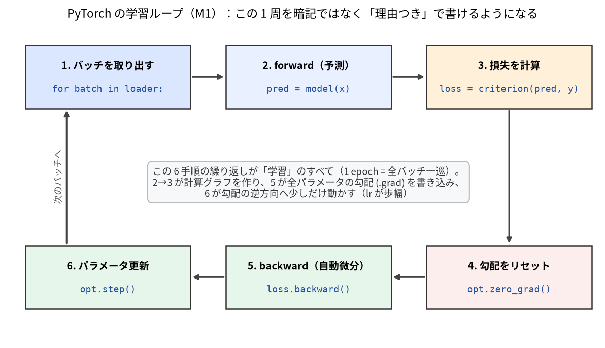

# M1: PyTorch 速習

> **この章のゴール**
> - **テンソル (tensor)** を作り、`shape` / `dtype` / `device` を読めるようになる。
> - **ブロードキャスト (broadcasting)** の規則を理解し、形の違う配列の演算を予測できる。
> - **自動微分 (autograd)**: `requires_grad` / `backward()` / `.grad` / `no_grad` を使える。
> - `nn.Module` / `nn.Linear` / `nn.Sequential` でモデルを定義できる。
> - 損失と optimizer (Adam / `zero_grad` / `backward` / `step`) で**学習ループ**を書ける。
> - `Dataset` / `DataLoader`（`__len__` / `__getitem__` / バッチ化 / `shuffle`）を使える。
> - **「1 バッチに過学習できるか」** という学習デバッグの鉄則を理解する。
>
> **前提**: [M0](m0_overview.md) を読み、`uv sync` 済みで `uv run pytest` が通る状態。
> Python の関数が書ければ OK。本章のコードはすべて **CPU・コピペで動く** ように書いています。
>
> **所要時間**: 90〜120 分（手を動かしながら）。

この章は **PyTorch の基礎に集中**します。diffusion / VLM の座学は既知前提なので触れません。
代わりに、後の章で実際に使う **本教材の題材**（状態 `[3]`・行動チャンク `[T, 3]`・小さな回帰）に寄せて練習します。

> 本章のコードは Python の対話シェルか、短い `.py` を `python xxx.py` で実行すれば動きます。
> 各ブロックの冒頭に `import torch` 等を書いていますが、続けて実行する場合は一度で十分です。

---

## 1.1 テンソル (tensor) ―― PyTorch の基本データ

テンソルは「GPU でも動く、自動微分に対応した多次元配列」です。NumPy の `ndarray` とほぼ同じ感覚で使えます。

### 作る

```python
import torch

a = torch.tensor([1.0, 2.0, 3.0])          # リストから（状態 state[3] のイメージ）
z = torch.zeros(8, 3)                        # 0 埋め [8, 3]（行動チャンク[T=8, A=3] のイメージ）
o = torch.ones(2, 3)                         # 1 埋め
r = torch.randn(4, 3)                        # 標準正規分布から [4, 3]
e = torch.arange(6)                          # 0,1,2,3,4,5
print(a)
print(z.shape, r.shape)
```

出力例:

```text
tensor([1., 2., 3.])
torch.Size([8, 3]) torch.Size([4, 3])
```

### shape（形）

`shape` は各次元の大きさです。VLA では shape を読めることが最重要スキルになります（観測画像 `[B, C, H, W]`、行動 `[B, T, A]` など）。

```python
import torch

x = torch.randn(4, 8, 3)        # 例: バッチ4, チャンク長8, 行動次元3 = [B, T, A]
print(x.shape)                  # torch.Size([4, 8, 3])
print(x.shape[0], x.ndim)       # 4 3   （バッチサイズ と 次元数）

# 形を変える（要素数は不変）
flat = x.reshape(4, 24)         # [4, 8*3] = [4, 24]
print(flat.shape)               # torch.Size([4, 24])

# 次元の追加・削除
s = torch.randn(3)              # [3]
print(s.unsqueeze(0).shape)     # [1, 3]  先頭にバッチ次元を足す
print(s.unsqueeze(0).squeeze(0).shape)  # [3]  大きさ1の次元を消す
```

> **読み方の規約（本教材共通）**
> - `B` = バッチサイズ、`T` または `C` = チャンク長（時間ステップ数）、`A` = 行動次元(=3)、`D` = 特徴次元。
> - 画像は `[B, C, H, W]`（C=チャンネル=3, H=W=64）。
> - 行動チャンクは `[B, T, A]`（例 `[64, 8, 3]`）。
> - 状態は `[B, D]`（例 `[64, 3]`）。

### dtype（型）

`dtype` は数値の型です。**float と int を混ぜると壊れる**ので注意します（後のバグ修正演習で出ます）。

```python
import torch

f = torch.tensor([1.0, 2.0])        # 既定は float32
i = torch.tensor([1, 2])            # 整数リストなら int64
print(f.dtype, i.dtype)             # torch.float32 torch.int64

# 明示的に指定 / 変換
g = torch.zeros(3, dtype=torch.float32)
h = i.float()                       # int64 -> float32
j = f.long()                        # float32 -> int64
print(g.dtype, h.dtype, j.dtype)
```

出力例:

```text
torch.float32 torch.int64
torch.float32 torch.float32 torch.int64
```

> **本教材での型の約束**（[`synthetic_dataset.py`](../src/vla_learn/datasets/synthetic_dataset.py) の `__getitem__` より）:
> 画像・状態・行動・pad_mask は **float32**、言語のトークン ID (`tokens`) は **int64**。
> トークン ID が int64 なのは、後で `nn.Embedding`（埋め込み表）の**索引**として使うからです。索引は整数でなければなりません。

### device（CPU / GPU）

テンソルは CPU か GPU のどちらかに乗っています。**鉄則: 演算する者どうしは同じ device に置く**（混在は実行時エラー）。

```python
import torch

x = torch.randn(2, 3)               # 既定は CPU
print(x.device)                     # cpu

# 本教材は CPU 完結。device を扱うヘルパが用意されています:
from vla_learn.utils.device import get_device
dev = get_device()                  # GPU があれば cuda、無ければ cpu
x = x.to(dev)                       # その device へ移す
print(x.device)
```

`device.py` のコメントにもあるとおり、「テンソルとモデルは同じ device に置く」が PyTorch の鉄則です。本教材は CPU だけで完結するので、基本は `cpu` のままで困りません。

### NumPy との行き来

環境 (`envs/`) は NumPy で世界を作ります。学習は PyTorch です。両者は橋渡しできます。

```python
import numpy as np
import torch

arr = np.array([0.3, 0.7, 0.0], dtype=np.float32)   # state [ax, ay, gripper]
t = torch.from_numpy(arr)            # NumPy -> tensor（メモリ共有）
print(t, t.dtype)                    # tensor([0.3000, 0.7000, 0.0000]) torch.float32

back = t.numpy()                     # tensor -> NumPy
print(type(back))
```

> 実際 [`SyntheticVLADataset.__getitem__`](../src/vla_learn/datasets/synthetic_dataset.py) は
> `torch.from_numpy(...)` で NumPy 画像・状態・行動を tensor に変換して返しています。

---

## 1.2 ブロードキャスト (broadcasting)

形の違うテンソルどうしの演算を、PyTorch が**自動で形を合わせて**計算してくれる仕組みです。
規則は「**末尾の次元から見て、大きさが等しい or どちらかが 1 なら OK**」。1 の側が引き伸ばされます。

```python
import torch

x = torch.randn(4, 3)               # [B=4, D=3]
b = torch.tensor([10.0, 20.0, 30.0])  # [3]  -> [1, 3] とみなされ各行に足される
print((x + b).shape)                # [4, 3]

col = torch.tensor([[1.0], [2.0], [3.0], [4.0]])  # [4, 1] -> 各列にブロードキャスト
print((x + col).shape)              # [4, 3]
```

本教材で実際に使われる例（[`functional.py`](../src/vla_learn/functional.py) の `masked_mse`）:

```python
import torch

se   = torch.randn(4, 8, 3) ** 2    # 二乗誤差 [B, C, A]
mask = torch.ones(4, 8)             # pad_mask [B, C]（1=有効, 0=パディング）
mask3 = mask.unsqueeze(-1)          # [B, C, 1]
masked = se * mask3                 # [B,C,1] が [B,C,3] にブロードキャストされる
print(masked.shape)                 # torch.Size([4, 8, 3])
```

`unsqueeze(-1)` で `[B, C]` を `[B, C, 1]` にしてから掛けると、行動次元 `A=3` 方向に同じマスクが伸びて、パディング位置の誤差をまとめて 0 にできます。**「次元を 1 にして broadcast」は頻出パターン**です。

> **よくある罠**: `[8, 3]` と `[3, 8]` は broadcast できません（末尾から見て 3≠8 かつ 1 でもない）。
> 「形が合わない」エラーの大半はこれです。落ち着いて `.shape` を print しましょう。

---

## 1.3 自動微分 (autograd)

ニューラルネットの学習は「損失を下げる方向にパラメータを少し動かす」の繰り返しです。
その「方向」= **勾配 (gradient)** を、PyTorch が**自動で**計算してくれるのが autograd です。座学で出てきた誤差逆伝播 (backpropagation) を、手で微分せずに使えます。

### requires_grad / backward / .grad

```python
import torch

# requires_grad=True にしたテンソルは「微分の対象」として追跡される
x = torch.tensor([2.0], requires_grad=True)
y = x ** 2 + 3 * x          # y = x^2 + 3x
y.backward()                # dy/dx を計算（逆伝播）
print(x.grad)               # dy/dx = 2x + 3 = 2*2+3 = 7  -> tensor([7.])
```

出力例:

```text
tensor([7.])
```

ポイント:
- `requires_grad=True` のテンソルから計算した結果には、その履歴（計算グラフ）が記録されます。
- `loss.backward()` を呼ぶと、グラフを逆向きにたどって各 `requires_grad=True` のテンソルの `.grad` に勾配が貯まります。
- **`.grad` は加算されていく**（上書きではない）。だから毎ステップ `zero_grad()` でリセットが必要です（後述。忘れると壊れます）。

### no_grad（勾配を切る）

推論時や、勾配が要らない処理では `torch.no_grad()` で追跡を止めます。**メモリと速度の節約**になり、また「パラメータ更新の式に勾配を混ぜない」ために必須です。

```python
import torch

w = torch.tensor([1.0], requires_grad=True)

with torch.no_grad():
    w2 = w * 5              # この計算は追跡されない
print(w2.requires_grad)    # False

# パラメータを手で更新するときも no_grad の中で行う（自動更新は後で optimizer に任せます）
```

> 実装では [`TinyVLA.predict`](../src/vla_learn/models/tiny_vla.py) が `@torch.no_grad()` デコレータで
> 推論し、評価ループ（`evaluation/rollout.py`）でも勾配を切って行動を予測します。
> **学習中は勾配を追跡、推論中は切る**、と覚えてください。

---

## 1.4 nn.Module / nn.Linear / nn.Sequential

毎回パラメータを手で持つのは大変です。PyTorch では **`nn.Module`** を継承してモデルを作ると、パラメータ管理・device 移動・学習/評価モード切替などを面倒見てくれます。

### nn.Linear（全結合層）

`nn.Linear(in, out)` は `y = x @ W^T + b` を計算する層です。入力の**最後の次元**を `in` から `out` に変えます。

```python
import torch
import torch.nn as nn

lin = nn.Linear(3, 64)          # 状態 state[*, 3] -> 特徴[*, 64]
s = torch.randn(4, 3)           # [B=4, 3]
out = lin(s)
print(out.shape)                # torch.Size([4, 64])
print(lin.weight.shape, lin.bias.shape)  # [64, 3] [64]
```

> これは本教材の [`StateEncoder`](../src/vla_learn/models/state_encoder.py)（状態 `[*,3]` → `[*,64]`）と同じ発想です。

### nn.Module を継承する

```python
import torch
import torch.nn as nn

class TinyMLP(nn.Module):
    def __init__(self, in_dim=3, hidden=32, out_dim=3):
        super().__init__()                      # ← 必ず最初に呼ぶ
        self.fc1 = nn.Linear(in_dim, hidden)
        self.fc2 = nn.Linear(hidden, out_dim)
        self.act = nn.ReLU()

    def forward(self, x):                       # 順伝播を書く
        h = self.act(self.fc1(x))
        return self.fc2(h)

model = TinyMLP()
x = torch.randn(4, 3)                            # [B, 3]
y = model(x)                                     # model(x) は forward(x) を呼ぶ
print(y.shape)                                   # torch.Size([4, 3])

# パラメータは自動で集まる
n_params = sum(p.numel() for p in model.parameters())
print("params:", n_params)
```

> モデルを呼ぶときは `model.forward(x)` ではなく **`model(x)`** と書きます（フックなどが正しく動くため）。
> パラメータ数を数える書き方は、本教材の [`count_parameters`](../src/vla_learn/models/tiny_vla.py) と同じです
> （`TinyVLA` は約 0.42M パラメータでした）。

### nn.Sequential（層を直列に並べる）

分岐のない単純な積み重ねは `nn.Sequential` が簡潔です。

```python
import torch
import torch.nn as nn

mlp = nn.Sequential(
    nn.Linear(3, 32), nn.ReLU(),
    nn.Linear(32, 32), nn.ReLU(),
    nn.Linear(32, 3),
)
print(mlp(torch.randn(4, 3)).shape)              # torch.Size([4, 3])
```

> 実際 [`VLABackbone`](../src/vla_learn/models/tiny_vla.py) の融合 MLP は
> `nn.Sequential(nn.Linear(...), nn.ReLU(inplace=True), nn.Linear(...), nn.ReLU(inplace=True))`
> で書かれています。本章の書き方そのままです。

---

## 1.5 学習ループ（損失と optimizer）

ここが PyTorch の心臓部です。**毎ステップ次の 4 つを順番に呼ぶ**だけ、と覚えてください。

```text
   for ステップ in 学習:
     ① pred = model(x)              # 順伝播（予測）
     ② loss = 損失(pred, target)     # どれだけ間違ったか
     ③ optimizer.zero_grad()        # 前回の勾配を消す（忘れると加算され壊れる）
        loss.backward()             # 逆伝播（.grad を計算）
     ④ optimizer.step()             # パラメータを勾配方向に更新
```



### 最小の完全な例: 小さな線形回帰

「`y = 2x + 1` を当てる」を、本教材の道具（`nn.Linear`・MSE・Adam）で学習します。**そのままコピペで動きます。**

```python
import torch
import torch.nn as nn

torch.manual_seed(0)

# 1) データ（答え y = 2x + 1。少しノイズを足す）
x = torch.randn(128, 1)                 # [N=128, 1]
y = 2.0 * x + 1.0 + 0.05 * torch.randn(128, 1)

# 2) モデル・損失・optimizer
model = nn.Linear(1, 1)                  # 直線 y = w x + b を学習
loss_fn = nn.MSELoss()                   # 平均二乗誤差
optimizer = torch.optim.Adam(model.parameters(), lr=0.05)

# 3) 学習ループ
for step in range(200):
    pred = model(x)                      # ① 順伝播  [128, 1]
    loss = loss_fn(pred, y)              # ② 損失（スカラ）
    optimizer.zero_grad()               # ③ 勾配リセット
    loss.backward()                     #    逆伝播
    optimizer.step()                    # ④ 更新
    if step % 50 == 0:
        print(f"step {step:3d}  loss = {loss.item():.4f}")

w = model.weight.item()
b = model.bias.item()
print(f"学習結果: y ≈ {w:.2f} x + {b:.2f}  (正解は 2.00 x + 1.00)")
```

出力例（数値は環境でぶれます）:

```text
step   0  loss = 10.1834
step  50  loss = 0.7888
step 100  loss = 0.0052
step 150  loss = 0.0017
学習結果: y ≈ 2.00 x + 1.00  (正解は 2.00 x + 1.00)
```

各行の意味:
- **`loss_fn = nn.MSELoss()`**: 予測と正解の差の二乗の平均。回帰の定番（本教材 M4 も MSE です）。
- **`torch.optim.Adam(model.parameters(), lr=...)`**: 更新方法。`model.parameters()` を渡すことで「どのテンソルを更新するか」を optimizer に教えます。`lr`（学習率）は 1 歩の大きさ。
- **`loss.item()`**: スカラのテンソルから Python の `float` を取り出します。`print` や記録には `.item()` を使う（テンソルのまま貯めると計算グラフが残りメモリを食う/壊れる原因に。後のバグ修正演習で扱います）。

> **`zero_grad()` を忘れるとどうなる？**
> `.grad` は加算され続けるので、勾配がどんどん膨らみ、更新が暴れて loss が下がりません。
> 「loss が下がらない」ときに真っ先に疑う定番バグです。

---

## 1.6 「1 バッチに過学習できるか」――学習デバッグの鉄則

VLA に限らず、学習コードを書いたら**最初に必ず確認すべきこと**があります。

> **鉄則**: モデルと学習ループが正しければ、**小さな 1 バッチ（数十サンプル）には必ず過学習できる**。
> 過学習すらできないなら、損失・shape・最適化・勾配のどこかにバグがある。

なぜか。汎化（未知データへの一般化）は難しい問題ですが、「**手元の固定された数十サンプルを丸暗記する**」のは、配線が正しければニューラルネットには簡単なはずだからです。
つまり「1 バッチに過学習できるか」は **モデルの賢さのテストではなく、配線（パイプライン）の健全性テスト**です。大きなデータで延々と回す前に、これで素早くバグを切り分けます。

確認のしかた:
1. データを**ごく少数**（例 16 サンプル）に固定する（`shuffle` は切る or 同じバッチを使い続ける）。
2. 同じバッチで**何百ステップ**も学習を回す。
3. **loss がほぼ 0 近くまで下がれば合格**。下がらなければバグを探す。

上の線形回帰の例も、実は 128 サンプルを固定して回しているので「1 バッチ過学習」に近い形でした。loss が小さく下がりましたね。これが「配線は正しい」というシグナルです。

> **本教材での実例**: [`tests/test_overfit_tiny_batch.py`](../tests/test_overfit_tiny_batch.py) は、
> `TinyVLA` を 1 バッチ（16 サンプル）で 200 ステップ学習し、
> **loss が最初の 20% 未満まで下がること**を `assert` でチェックしています。
> これがこの教材の「健全性テスト」です。各章の演習でも必ず 1 問、この確認を入れます。

うまく下がらないときのチェックリスト:
- `optimizer.zero_grad()` を呼んでいるか（最頻出バグ）。
- 学習率 `lr` が極端でないか（大きすぎると発散、小さすぎると動かない。まず `1e-3` 付近から）。
- 予測と正解の **shape が一致**しているか（ズレていると broadcast で意図しない損失になる）。
- モデルの出力に `model.parameters()` が勾配でつながっているか（`detach()` や `no_grad` で切っていないか）。
- 入力・モデルが同じ **device / dtype** か。

---

## 1.7 Dataset と DataLoader

データが増えると、「どう 1 件を取り出すか」と「どうミニバッチにまとめるか」を分けて書きたくなります。
PyTorch では **`Dataset`** が前者、**`DataLoader`** が後者を担当します。

### Dataset: `__len__` と `__getitem__`

`Dataset` は 2 つのメソッドさえ実装すればよい、というルールです。

- `__len__(self)` … データ件数を返す。
- `__getitem__(self, idx)` … `idx` 番目の 1 件を返す（dict やタプル）。

本教材の題材に寄せた最小例（状態 `[3]` → 行動チャンク `[8, 3]` の組を返す擬似データセット）:

```python
import torch
from torch.utils.data import Dataset

class ToyVLADataset(Dataset):
    def __init__(self, n=100, chunk_len=8, action_dim=3):
        torch.manual_seed(0)
        self.states  = torch.randn(n, 3)                       # [N, 3]
        self.actions = torch.randn(n, chunk_len, action_dim)   # [N, 8, 3]

    def __len__(self):
        return self.states.shape[0]                            # 件数

    def __getitem__(self, idx):
        return {
            "state":  self.states[idx],                        # [3]
            "action": self.actions[idx],                       # [8, 3]
        }

ds = ToyVLADataset()
print(len(ds))                       # 100
sample = ds[0]
print(sample["state"].shape, sample["action"].shape)   # torch.Size([3]) torch.Size([8, 3])
```

> 実物の [`SyntheticVLADataset`](../src/vla_learn/datasets/synthetic_dataset.py) も同じ形で、
> `__getitem__` が `{"image":[3,64,64], "state":[3], "tokens":[L], "action":[8,3], "pad_mask":[8]}`
> を返します（型は画像・状態・行動・pad_mask が float32、tokens が int64）。M3 で詳しく作ります。

### DataLoader: バッチ化と shuffle

`DataLoader` は `Dataset` を包み、**ミニバッチにまとめて (`batch_size`)**、**毎エポック順番をシャッフル (`shuffle=True`)** して、繰り返し取り出せるようにします。
1 件が `[3]` でも、`batch_size=16` で取り出すと先頭に**バッチ次元が付いて `[16, 3]`** になります。

```python
import torch
from torch.utils.data import DataLoader

loader = DataLoader(ds, batch_size=16, shuffle=True)

batch = next(iter(loader))           # 最初のバッチを 1 つ取り出す
print(batch["state"].shape)          # torch.Size([16, 3])   ← 先頭に B=16 が付く
print(batch["action"].shape)         # torch.Size([16, 8, 3])

# 学習ではこう回す（1 エポック = 全データを一巡）
for batch in loader:
    s = batch["state"]               # [16, 3]
    a = batch["action"]              # [16, 8, 3]
    # ここで model(...) と loss.backward() ...
    pass
```

ポイント:
- **`batch_size`**: 一度に何件まとめるか。大きいほど勾配が安定し速いが、メモリを食う。
- **`shuffle=True`**: 毎エポック並び替える。順序の偏りで学習がゆがむのを防ぐ。**学習データは True、評価データは False** が定石。
- **辞書もまとめてくれる**: `__getitem__` が dict を返すと、DataLoader が**キーごとにスタック**して `{"state": [B,3], "action": [B,8,3]}` にしてくれます（賢い）。

> **「1 バッチ過学習」との合わせ技**: `batch = next(iter(loader))` で 1 バッチだけ取り出し、
> それを使い回して数百ステップ回せば、1.6 の健全性テストがそのまま書けます。
> [`tests/test_overfit_tiny_batch.py`](../tests/test_overfit_tiny_batch.py) もまさに
> `next(iter(DataLoader(ds, batch_size=16, shuffle=True)))` で 1 バッチを取り出しています。

### 学習ループ + DataLoader（まとめ）

これまでの部品を全部つなぐと、本教材で何度も書く形になります。

```python
import torch
import torch.nn as nn
from torch.utils.data import DataLoader

torch.manual_seed(0)
ds = ToyVLADataset(n=256)                              # 上で定義した擬似データ
loader = DataLoader(ds, batch_size=32, shuffle=True)

# 状態[3] -> 行動チャンク[8,3] を出すごく小さなモデル
model = nn.Sequential(nn.Linear(3, 64), nn.ReLU(), nn.Linear(64, 8 * 3))
loss_fn = nn.MSELoss()
optimizer = torch.optim.Adam(model.parameters(), lr=1e-3)

for epoch in range(5):
    running = 0.0
    for batch in loader:
        s = batch["state"]                            # [B, 3]
        a = batch["action"]                           # [B, 8, 3]
        pred = model(s).view(-1, 8, 3)                # [B, 24] -> [B, 8, 3]
        loss = loss_fn(pred, a)
        optimizer.zero_grad()
        loss.backward()
        optimizer.step()
        running += loss.item()
    print(f"epoch {epoch}  mean loss = {running / len(loader):.4f}")
```

> ここでは答え `a` がランダムなので「賢く当てる」のは無理ですが、配線（`Dataset → DataLoader → model → loss → backward → step`）が一巡することを確認できます。
> 本物のデータ（M3 以降）に差し替えれば、そのまま VLA の学習になります。

---

## 1.8 デバッグの型 — shape エラーを最速で潰す

初心者が最も時間を溶かすのは shape エラーです。「型」を決めておくと数分で潰せます。

**① エラーメッセージは最後の行から読む。** 実例:

```text
RuntimeError: mat1 and mat2 shapes cannot be multiplied (4x1024 and 64x128)
```

`mat1` が「実際に流れてきた入力」（`[B=4, 1024]`）、`mat2` が「層が持つ重み」
（`in_features=64` の `nn.Linear(64, 128)` の中身）。つまり「1024 次元が来たのに 64 次元を
期待する層に入れた」と読めます。**どこで**起きたかは、traceback の中の**自分が書いた `forward` の行**
を探します（ライブラリ内部の行は読み飛ばしてよい）。

**② 関門 assert を置く。** 「ここではこの shape のはず」を宣言しておくと、ズレた瞬間の近くで止まります:

```python
def forward(self, image, state, tokens):
    assert image.ndim == 4 and image.shape[1:] == (3, 64, 64), image.shape
    assert state.shape[-1] == 3, state.shape
    ...
```

**③ 学習の前に `B=2` で 1 周通す。** データ 2 件だけで `forward → loss → backward → step` を
1 回実行してから本番の学習に進みます。本リポジトリの [`tests/test_model_forward.py`](../tests/test_model_forward.py)
がこの型の実例です（1.6 節の「1 バッチ過学習」はこの発展形）。

**④ `print(x.shape)` を恐れない。** 途中の shape を疑ったら forward に print を挟むのが最速です。
コードのコメントに `# [B, 64, 8, 8]` のような **shape 注釈**を書く習慣（本リポジトリの全コードが
そうなっています）も、未来の自分へのデバッグ支援になります。

---

## まとめ

- **tensor**: 多次元配列。`shape`（形）・`dtype`（型）・`device`（CPU/GPU）を読めることが最重要。float と int、CPU と GPU は混ぜない。
- **broadcast**: 末尾の次元から見て「等しい or 片方が 1」なら自動で形が合う。`unsqueeze(-1)` で 1 を作って掛けるのは頻出パターン。
- **autograd**: `requires_grad=True` → 計算 → `loss.backward()` で `.grad` に勾配が貯まる。推論は `no_grad`。`.grad` は加算されるので `zero_grad` が必要。
- **nn.Module / nn.Linear / nn.Sequential**: モデルを定義しパラメータを自動管理。呼び出しは `model(x)`。
- **学習ループ**: `pred → loss → zero_grad → backward → step` の 4 つ。`Adam` に `model.parameters()` を渡す。記録は `.item()`。
- **1 バッチ過学習**: 学習コードを書いたら最初に確認する鉄則。配線の健全性テスト。
- **Dataset / DataLoader**: `__len__` と `__getitem__` で 1 件を定義 → `DataLoader` でバッチ化・`shuffle`。バッチ化で先頭に `B` 次元が付く。

これで道具が一通りそろいました。次章からは、この道具で実際にロボットの行動を学習します。

## 次の章へ

[M2: 最小の模倣学習](m2_imitation.md) へ進みます。まず「状態 → 行動」「画像 → 行動」をこの学習ループで回帰し、**なぜ素朴な模倣はロールアウトで崩れるのか**（行動チャンクが必要になる理由）を体験します。

---

### この章の演習

手を動かして定着させましょう。
- 問題: [`../exercises/m1/README.md`](../exercises/m1/README.md)
- 解答と解説: [`../solutions/m1/README.md`](../solutions/m1/README.md)
