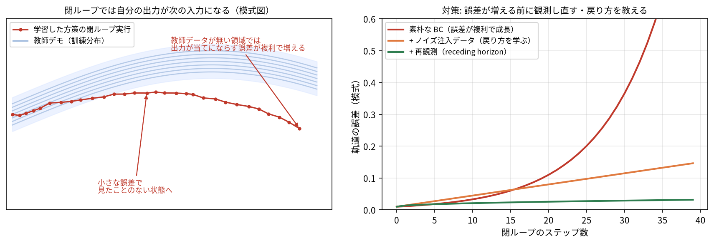

# M2: 最小の模倣学習（imitation learning / behavior cloning）

> この章のゴール:
> - **模倣学習 (imitation learning)** ＝ 「お手本の行動」を教師にして「状態 → 行動」を回帰する、という考え方を体で覚える。
> - まず `state[3] → action[3]` の最小モデルを学習し、次に `image → action` へ拡張する。
> - **本章の山場**: 素朴な模倣学習（behavior cloning, BC）が**閉ループで崩れる**理由＝**分布シフト (distribution shift)** と**誤差蓄積 (compounding error)** を直感と ASCII 図で理解し、
>   `generate_episodes(action_noise=...)` による**ノイズ注入 (DART / DAgger 風)** で対策を体験する。
> - 学習デバッグの鉄則「**1 バッチに過学習できるか**」を実際に確認する。
>
> 前提: [M1](m1_pytorch.md)（テンソル・autograd・`nn.Module`・学習ループ・Dataset/DataLoader）。
> 所要時間: 60〜90 分（CPU。重い学習はしません）。

---

## 0. この章で作る「最小の VLA の祖先」

最終的な VLA は `画像 + 言語 + 状態 → 行動チャンク` を出します（[M4](m4_tiny_vla_mse.md) で完成）。
でもいきなり全部入りだと、何が効いているのか分かりません。そこでこの章では、**言語をいったん外し**、

1. まず `状態 state[3] → 行動 action[3]`（画像すら使わない）
2. 次に `画像 image[3,64,64] → 行動 action[3]`

という 2 段階の「祖先モデル」を作ります。やることは M1 で学んだ学習ループの応用です。
新しいのは「**教師データがどこから来るか**」＝ **エキスパート (expert)** の存在です。

> 座学とのつながり: これは強化学習ではありません。報酬を最大化するのではなく、
> 「お手本の入力→出力ペア」をそのまま**教師あり回帰**で覚えるだけです。
> 拡散モデルで「データ分布を真似る」のと同じく、ここでも**エキスパートの行動分布を真似ます**。

---

## 1. エキスパート（お手本）とは

このリポジトリには、ニューラルネットを一切使わない**解析エキスパート**が入っています
（[`../src/vla_learn/envs/expert.py`](../src/vla_learn/envs/expert.py)）。
ワールドの真の状態を直接読めるので、ルールベースで**毎回成功**します（成功率 100%）。

```python
# ../src/vla_learn/envs/expert.py より（抜粋）
def expert_action(world: WorldState) -> np.ndarray:
    """現在のワールド状態から、お手本の行動 [dx, dy, grip_cmd] を返す。"""
    agent = world.agent_xy
    obj = world.objects_pos[world.target_obj]
    goal = world.goals_pos[world.target_goal]
    holding = world.held == world.target_obj
    ...
```

考え方はシンプルな状態機械です:

- 対象ブロックを**持っていない** → ブロックへ近づき、十分近ければグリッパを閉じて掴む
- 対象ブロックを**持っている** → ゴールへ近づき、十分近ければグリッパを開いて置く

模倣学習では、このエキスパートに環境を解かせて「**そのとき何を見て (観測)、何をしたか (行動)**」を
大量に記録し、その `観測 → 行動` をニューラルネットに**教師あり学習**で覚えさせます。

> 「エキスパートが必要なら、最初からエキスパートを使えばいいのでは？」と思うかもしれません。
> ポイントは、エキスパートは**真の状態 `world`** を覗いていること。
> 一方、学習するモデルが見られるのは**画像と状態だけ**（本物のロボットと同じ条件）です。
> つまり「真の状態を知っている先生」から「センサしか見られない生徒」へ知識を移すのが模倣学習です。

---

## 2. デモを集める: `generate_episodes`

エピソード（1 回の試行）を集めるのは
[`../src/vla_learn/datasets/synthetic_dataset.py`](../src/vla_learn/datasets/synthetic_dataset.py)
の `generate_episodes` です。中身（抜粋）はこうなっています:

```python
# ../src/vla_learn/datasets/synthetic_dataset.py より（抜粋・コメント簡略化）
while not done:
    w = obs["world"]
    a = expert_action(w)          # ← 記録するラベルは常にクリーンなエキスパート行動
    agents.append([...])           # state を記録
    objs.append(w.objects_pos.copy())
    acts.append(a.copy())          # action を記録
    a_exec = a.copy()
    if action_noise > 0:           # 実行だけノイズを足して軌道をずらす（grip は乱さない）
        a_exec[0] += noise_rng.normal(0.0, action_noise)
        a_exec[1] += noise_rng.normal(0.0, action_noise)
    obs, _, done, info = env.step(a_exec)
```

いまは `action_noise=0`（デフォルト）として、まずは普通にデモを集めましょう。

```python
from vla_learn.datasets import generate_episodes

eps = generate_episodes(n_episodes=200, seed=0)   # 成功エピソードだけ集める
print("エピソード数:", len(eps))
print("最初のエピソードのキー:", list(eps[0].keys()))
print("actions の shape:", eps[0]["actions"].shape)   # [T, 3]
print("agent (state) の shape:", eps[0]["agent"].shape) # [T, 3]
print("instruction:", eps[0]["instruction"])
```

出力例（数値はシードや環境でぶれます）:

```text
エピソード数: 200
最初のエピソードのキー: ['agent', 'objects_pos', 'objects_color', 'goals_pos', 'goals_color', 'target_obj', 'target_goal', 'instruction', 'actions']
actions の shape: (9, 3)
agent (state) の shape: (9, 3)
instruction: 赤ブロックをつかんで黄ゴールへ
```

各エピソードは `T`（おおむね 5〜16、平均 8〜9 程度。配置によりぶれます）ステップの時系列で、
`agent[t]`＝そのときの状態 `[ax, ay, gripper]`、`actions[t]`＝そのとき取った行動 `[dx, dy, grip_cmd]` です。

> ここでは**行動チャンク**（まとめて 8 ステップ予測）はまだ使いません。
> 「1 ステップの行動」を 1 つ予測する素朴版から始めます。チャンクは [M3](m3_data_actions.md) で導入します。

---

## 3. 最小の模倣学習（その1）: `state[3] → action[3]`

まずは画像も言語も使わず、状態だけから行動を当てる**いちばん小さい回帰**をやります。
M1 の学習ループがそのまま使えることを確認しましょう。

### 3.1 データを `(state, action)` のペアに平らにする

エピソードは時系列ですが、素朴 BC では時間構造を忘れて
**全時刻の `(state, action)` をただ集めた集合**として扱えば十分です。

```python
import numpy as np
import torch
from vla_learn.datasets import generate_episodes

eps = generate_episodes(n_episodes=300, seed=0)

# 全エピソード・全時刻を縦に積む
states  = np.concatenate([ep["agent"]   for ep in eps], axis=0)  # [sumT, 3]
actions = np.concatenate([ep["actions"] for ep in eps], axis=0)  # [sumT, 3]
print("学習サンプル数:", states.shape[0], "  state:", states.shape, " action:", actions.shape)

X = torch.from_numpy(states).float()    # [N, 3]
Y = torch.from_numpy(actions).float()   # [N, 3]
```

出力例:

```text
学習サンプル数: 4123   state: (4123, 3)  action: (4123, 3)
```

### 3.2 2 層 MLP を定義する（`nn.Module`）

```python
import torch.nn as nn

class StateToAction(nn.Module):
    def __init__(self, in_dim=3, hidden=64, out_dim=3):
        super().__init__()
        self.net = nn.Sequential(
            nn.Linear(in_dim, hidden),
            nn.ReLU(),
            nn.Linear(hidden, hidden),
            nn.ReLU(),
            nn.Linear(hidden, out_dim),   # [B, 3] を出力（回帰なので活性化なし）
        )

    def forward(self, state):    # state: [B, 3]
        return self.net(state)   # -> [B, 3]
```

> なぜ最後に活性化を付けないのか: 出力は連続値の行動 `[dx, dy, grip_cmd]` です。
> `dx, dy` は負にもなりうるので、`ReLU` や `Sigmoid` で範囲を縛るとお手本を再現できません。
> 回帰の出力層は素のまま（恒等写像）が基本です。

### 3.3 学習ループ（M1 の応用そのまま）

```python
from torch.utils.data import TensorDataset, DataLoader
from vla_learn.utils import set_seed

set_seed(0)
loader = DataLoader(TensorDataset(X, Y), batch_size=256, shuffle=True)

model = StateToAction()
opt = torch.optim.Adam(model.parameters(), lr=1e-3)
loss_fn = nn.MSELoss()

for epoch in range(20):
    total = 0.0
    for xb, yb in loader:
        pred = model(xb)            # [B, 3]
        loss = loss_fn(pred, yb)    # 平均二乗誤差
        opt.zero_grad()
        loss.backward()
        opt.step()
        total += loss.item() * len(xb)
    if epoch % 5 == 0 or epoch == 19:
        print(f"epoch {epoch:2d}  train MSE = {total/len(X):.4f}")
```

出力例（傾向。実際の値はぶれます）:

```text
epoch  0  train MSE = 0.1707
epoch  5  train MSE = 0.0347
epoch 10  train MSE = 0.0323
epoch 19  train MSE = 0.0318
```

loss が下がれば、「状態 → 行動」をそれっぽく回帰できています
（ある程度で頭打ちになるのは、`state[3]` だけでは情報が足りないからです。4 節で詳しく）。
ただし **MSE が下がること** と **タスクが解けること**は別物です。これが次節の主題です。

> ⚠️ ここで `state` を正規化していないことに注意してください（`ax,ay∈[0,1], gripper∈{0,1}` なので、
> たまたま大きく外れた値はありません）。本番では正規化が効きます → [M3](m3_data_actions.md)。

---

## 4. 【山場】なぜ素朴な模倣は閉ループで崩れるのか

ここがこの章でいちばん大事なところです。
3 節の学習は **オフラインの MSE** を下げただけ。実際にロボットを動かす **閉ループ (closed-loop)** では、
**自分の行動が次の観測を作る**という決定的な違いがあります。

### 4.1 開ループ評価と閉ループ評価

- **開ループ (open-loop)**: データセットの `state` を入れて `action` を当て、MSE を測る。**状態は固定**。
- **閉ループ (closed-loop)**: モデルの行動を環境に渡し、**次の状態をモデル自身が作る**。
  予測がほんの少しズレると、**次に見る状態がデータに無かった状態**になっていきます。

図にすると、違いは「**入力をどこから持ってくるか**」の一点だけです:

```text
開ループ（データセットで MSE 測定）          閉ループ（実環境で動かす）
  state(固定) ─▶ model ─▶ action            state ─▶ model ─▶ action ─▶ env.step ─┐
                  │                            ▲                                   │
                  ▼                            │  次の state も少しズレる           ▼
            正解と比べて MSE                    └──── ズレた state がまた入力に ──── 次の state
                                              （ミスが自分に跳ね返り、雪だるま式に増える）
```

- 開ループの入力は **データセットが用意した正しい state**。だから誤差は積もりません。
- 閉ループの入力は **モデル自身が作った（ズレているかもしれない）state**。ここでミスが跳ね返ります。

### 4.2 誤差蓄積 (compounding error) の図

エキスパートは画面の中央付近の「お手本の通り道」だけを通ります。
学習モデルは各ステップでほんの少し（例: 0.02）ズレます。閉ループではそのズレが**積み上がり**、
やがてエキスパートが一度も通らなかった領域に入り、そこではモデルは出鱈目を返します。

```text
        エキスパートが通った領域（=学習データがある所）
        ┌───────────────────────────────────────────┐
 start  │ E→E→E→E→E→E→E→E→E→E→E→E→E→E→E→ goal       │   エキスパート: ずっとデータ内
        │  \                                         │
        │   M→M→M  …ここまでは真似できる              │
        │        \  ↑ 毎ステップ +0.02 ずつズレる     │
        │         M→M                                │
        │            \                               │
        └─────────────M─ ← ここから先はデータが無い ──┘
                        \   （誤差が積もって未知の状態へ）
                         M??  もう何をすべきか学んでいない → さらに大きくズレる → 失敗
```

これが **分布シフト (distribution shift)** と **誤差蓄積 (compounding error)** です:

- **分布シフト**: 学習時に見た状態の分布（＝エキスパートの軌道）と、
  推論時にモデル自身が訪れる状態の分布が**ズレる**。
- **誤差蓄積**: 1 ステップの小さな誤差が次の観測をわずかに変え、その誤差が次の入力になり…と
  **時間方向に雪だるま式**に増える。BC の弱点の根本原因です。



> 直感: 「**お手本は失敗の直し方を見せてくれない**」。
> エキスパートは完璧なので、軌道から外れた状況（＝リカバリ）が教師データにほぼ現れません。
> だからモデルは「外れたときにどう戻るか」を学べないのです。

### 4.3 まずは崩れる様子を「お手本との誤差」で体感する

実機評価（rollout）の完全版は [M4](m4_tiny_vla_mse.md) で `evaluate_policy` を使います。
ここでは PyTorch だけで、**ミニ閉ループ**を回して「ズレが積もる」のを観察します。
新しい環境を `reset` し、`state → action` モデルだけで動かし、各ステップで
「モデルの行動」と「（その状態での）エキスパートの正解行動」のズレを測ります。

> **▶ 先に予想してみてください（答えはこの節の最後）**
> 3 節で `state → action` の MSE は `0.03` 付近まで下がりました。では、このモデルを実際に環境で
> 動かしたら、**閉ループ成功率**は何 % くらいになると思いますか?
> - (a) MSE が十分小さいので 80% 以上
> - (b) そこそこで 40〜60%
> - (c) ほぼ 0%
>
> 直感では (a) や (b) に見えます。下のミニ閉ループで確かめましょう。

```python
import numpy as np
import torch
from vla_learn.envs import Tabletop2DEnv, expert_action

@torch.no_grad()
def mini_closed_loop(model, n_episodes=30, max_steps=48, seed=1000):
    model.eval()
    gaps, successes = [], 0
    for k in range(n_episodes):
        env = Tabletop2DEnv(seed=seed + k)
        obs = env.reset()
        ep_gap = []
        done = False
        while not done:
            state = torch.from_numpy(obs["state"]).float().unsqueeze(0)  # [1,3]
            a = model(state).squeeze(0).numpy()                          # [3]
            a_star = expert_action(obs["world"])                          # 正解（参考）
            ep_gap.append(float(np.linalg.norm(a[:2] - a_star[:2])))      # dx,dy のズレ
            obs, _, done, info = env.step(a)                              # ← 自分の行動で次状態が決まる
        gaps.append(np.mean(ep_gap))
        successes += int(info.get("success", False))
    return np.mean(gaps), successes / n_episodes

mean_gap, succ = mini_closed_loop(model)
print(f"閉ループでの平均ズレ(dx,dy) = {mean_gap:.4f}   成功率 = {succ:.2%}")
```

出力例（`state` だけの素朴 BC。値は大きくぶれます）:

```text
閉ループでの平均ズレ(dx,dy) = 0.0988   成功率 = 3.33%
```

**予想の答え合わせ: 正解は (c)。** オフライン MSE は `0.03` 付近まで下がったのに、閉ループ成功率はほぼゼロです。
「(a) のはず」と思った人ほど、この章の学びが大きいはずです。
**「MSE が小さい ≠ タスクが解ける」** を数字で確認できました（しかも `state[3]` だけでは
「どのブロックを・どこへ」が分からないので、そもそも情報不足。次節で画像を足します）。

> 💡 補足: `state[3]` は `(ax, ay, gripper)` だけで、**どのブロックが対象か・対象がどこか**が分かりません
> （画像や言語を見ていないので当然です）。だから素朴 `state→action` はそもそも情報不足でもあります。
> 次節で画像を足し、5 節で「分布シフトそのもの」への対策（ノイズ注入）を入れます。

---

## 5. 【対策】ノイズ注入で「リカバリのお手本」を作る（DART / DAgger 風）

分布シフトの正体は「**軌道から外れた状態のお手本が無い**」ことでした。
ならば、**わざと軌道を少し外して**、その「外れた状態」での正解行動を集めればよい——これが
`generate_episodes(action_noise=...)` の発想です。

仕組みを `synthetic_dataset.py` の抜粋（2 節）でもう一度見てください:

- `a = expert_action(w)` … **記録するラベルは常にクリーン**なエキスパート行動。
- `a_exec = a + ノイズ` … **実行だけ**を乱して軌道をずらす（`grip` は乱さない）。

つまり「**ずれた状態 → そこから正しく戻すための行動**」というペアが自然に集まります。

```text
ノイズなし（BC）            ノイズあり（DART/DAgger風）
  通り道は1本だけ            通り道のまわりに「外れ→戻す」例が増える
  E→E→E→E→E→goal           E→E→E→E→E→goal
                            ⤴︎ ⤵︎ ⤴︎ ⤵︎   ← 少しずらして実行
                            各点でラベルは「中心へ戻す」クリーン行動
  → 外れたら未知            → 外れても「戻し方」を学習済み → 崩れにくい
```

> 用語メモ:
> - **DAgger (Dataset Aggregation)**: 学習中のモデルを実際に動かし、その訪問状態でエキスパートに
>   正解を聞いて**データを足していく**反復手法。
> - **DART (Disturbances for Augmenting Robot Trajectories)**: 収集時に**外乱（ノイズ）**を注入して
>   訪問状態を広げる手法。本リポジトリの `action_noise` は **DART 風**（ラベルはクリーン）です。
> - どちらも狙いは同じ「**エキスパートの軌道の“まわり”も教師にして分布シフトを埋める**」。

### 5.1 実験: ノイズの有無で閉ループ成功率を比べる

ここからが本章の実験です。「**ノイズ注入したデータで学習したモデルのほうが、
閉ループで崩れにくい**」を自分の手で確認します。
公平に比べるため、**画像入力**で揃えます（情報不足を解消した上で、分布シフト対策の効果だけを見る）。

まず `image[3,64,64] → action[3]` のモデルを用意します（M1 の CNN の応用。畳み込み 2 段 + 全結合）。

```python
import numpy as np
import torch
import torch.nn as nn
from torch.utils.data import Dataset, DataLoader
from vla_learn.envs import Tabletop2DEnv, expert_action
from vla_learn.envs.render import render_world
from vla_learn.utils import set_seed


class ImageToAction(nn.Module):
    """[B,3,64,64] -> [B,3] の最小 CNN 回帰。"""
    def __init__(self, out_dim=3):
        super().__init__()
        self.conv = nn.Sequential(
            nn.Conv2d(3, 16, 3, stride=2, padding=1), nn.ReLU(),  # 64->32
            nn.Conv2d(16, 32, 3, stride=2, padding=1), nn.ReLU(), # 32->16
            nn.Conv2d(32, 32, 3, stride=2, padding=1), nn.ReLU(), # 16->8
        )
        self.head = nn.Sequential(
            nn.Flatten(),                 # [B, 32*8*8] = [B, 2048]
            nn.Linear(32 * 8 * 8, 128), nn.ReLU(),
            nn.Linear(128, out_dim),      # [B, 3]
        )

    def forward(self, image):     # image: [B, 3, 64, 64]
        return self.head(self.conv(image))


class ImgActionDataset(Dataset):
    """エピソード列から (image[3,64,64], action[3]) を返す素朴版（1 ステップ・チャンク無し）。"""
    def __init__(self, episodes):
        self.index = []
        self.eps = episodes
        for ei, ep in enumerate(episodes):
            for t in range(ep["actions"].shape[0]):
                self.index.append((ei, t))

    def __len__(self):
        return len(self.index)

    def __getitem__(self, i):
        ei, t = self.index[i]
        ep = self.eps[ei]
        img = render_world(
            ep["objects_pos"][t], ep["objects_color"],
            ep["goals_pos"], ep["goals_color"],
            ep["agent"][t, :2], float(ep["agent"][t, 2]), size=64,
        )  # [3,64,64]
        a = ep["actions"][t].astype(np.float32)  # [3]
        return torch.from_numpy(np.ascontiguousarray(img)), torch.from_numpy(a)
```

学習と閉ループ評価を 1 つの関数にまとめます:

```python
from vla_learn.datasets import generate_episodes

def train_image_bc(action_noise, n_episodes=300, epochs=8, seed=0):
    set_seed(seed)
    eps = generate_episodes(n_episodes=n_episodes, seed=seed, action_noise=action_noise)
    loader = DataLoader(ImgActionDataset(eps), batch_size=128, shuffle=True)

    model = ImageToAction()
    opt = torch.optim.Adam(model.parameters(), lr=1e-3)
    loss_fn = nn.MSELoss()
    model.train()
    for _ in range(epochs):
        for img, a in loader:
            loss = loss_fn(model(img), a)
            opt.zero_grad(); loss.backward(); opt.step()
    return model


@torch.no_grad()
def closed_loop_success(model, n_episodes=50, seed=2000):
    model.eval()
    succ = 0
    for k in range(n_episodes):
        env = Tabletop2DEnv(seed=seed + k)
        obs = env.reset()
        done = False
        while not done:
            img = torch.from_numpy(np.ascontiguousarray(obs["image"])).float().unsqueeze(0)  # [1,3,64,64]
            a = model(img).squeeze(0).numpy()                                                 # [3]
            obs, _, done, info = env.step(a)
        succ += int(info.get("success", False))
    return succ / n_episodes


# ノイズ無し vs あり（同じ評価シードで比較）
m0 = train_image_bc(action_noise=0.00)
m1 = train_image_bc(action_noise=0.03)
print("noise=0.00  閉ループ成功率:", f"{closed_loop_success(m0):.2%}")
print("noise=0.03  閉ループ成功率:", f"{closed_loop_success(m1):.2%}")
```

出力例（**強くぶれます**。重要なのは絶対値ではなく「**ノイズありが同等以上、多くの試行で上回る**」傾向）:

```text
noise=0.00  閉ループ成功率: 56.00%
noise=0.03  閉ループ成功率: 78.00%
```

> なぜ上がるのか: ノイズありのデータには「軌道から少し外れた状態＋そこから戻す正解」が含まれるため、
> 閉ループで誤差が積もっても**戻す行動**を出せるようになり、崩れにくくなります。
> 逆にノイズが大きすぎると軌道が荒れてラベルとの対応が弱まり、かえって悪化することもあります
> （本リポジトリの既定は `action_noise=0.03` 付近。演習で振ってみましょう）。
>
> ⚠️ CPU でも `n_episodes=300, epochs=8` で 1 設定あたり数十秒〜数分かかります。
> 時間がなければ `n_episodes=150, epochs=4` に落としても傾向は見えます。

> 座学とのつながり: 拡散モデルの学習で「ノイズを加えたサンプルから元へ戻す」ことを学ぶように、
> ここでも「**外乱で広げた状態から、お手本へ戻す**」ことを学ばせています。発想は地続きです。

---

## 6. 学習デバッグの鉄則: 1 バッチに過学習できるか

モデルと学習ループが正しければ、**小さな 1 バッチには必ず（ほぼ 0 まで）過学習できる**はずです。
できないなら、損失・shape・最適化・勾配・`.train()/.eval()` のどこかにバグがあります。
これは毎章使う鉄則です（リポジトリの [`../tests/test_overfit_tiny_batch.py`](../tests/test_overfit_tiny_batch.py) と同じ考え方）。

`state → action` モデルで試します:

```python
import torch
from torch.utils.data import TensorDataset, DataLoader
from vla_learn.utils import set_seed

set_seed(0)
# 3 節で作った X, Y（[N,3]）から 1 バッチだけ取り出す
one = next(iter(DataLoader(TensorDataset(X, Y), batch_size=32, shuffle=True)))
xb, yb = one

model = StateToAction()
opt = torch.optim.Adam(model.parameters(), lr=1e-3)
loss_fn = torch.nn.MSELoss()

first = None
for step in range(300):
    pred = model(xb)
    loss = loss_fn(pred, yb)
    opt.zero_grad(); loss.backward(); opt.step()
    if first is None:
        first = loss.item()
print(f"最初の loss = {first:.4f}  ->  最後の loss = {loss.item():.6f}")
assert loss.item() < 0.2 * first, "1 バッチに過学習できていない（どこかにバグ）"
print("OK: 1 バッチに過学習できました（学習機構は健全）")
```

出力例:

```text
最初の loss = 0.2232  ->  最後の loss = 0.038375
OK: 1 バッチに過学習できました（学習機構は健全）
```

> もし下がらなければ: ① `opt.zero_grad()` を忘れていないか ② `loss.backward()` の前に
> `pred` を `detach()` していないか ③ 入力と出力の shape が `[B,3]` で揃っているか
> ④ `model.train()` 状態か、を順に疑います（M1 のデバッグ手順）。

---

## 7. まとめ

- **模倣学習 (imitation learning / behavior cloning)** ＝ エキスパートの `観測 → 行動` を教師あり回帰で真似る。
- まず `state[3] → action[3]`、次に `image[3,64,64] → action[3]` を、M1 の学習ループの応用で実装した。
- **オフライン MSE が下がっても閉ループで崩れる**。原因は **分布シフト (distribution shift)** と
  **誤差蓄積 (compounding error)**。「お手本は失敗の直し方を見せてくれない」。
- 対策は `generate_episodes(action_noise=...)` による**ノイズ注入 (DART/DAgger 風)**:
  **実行だけ乱してラベルはクリーン**にし、「外れ → 戻す」のお手本を増やす。実験で成功率が上向くことを確認した。
- どの章でも「**1 バッチに過学習できるか**」で学習機構の健全性を最初に確かめる。

## 理解度チェック（30 秒・即答できるか）

演習に進む前に、本文の核心が腹落ちしたかを自己診断してください（クリックで答え）。

<details><summary>Q1. オフライン MSE が小さいのに、閉ループで失敗するのはなぜ?</summary>

閉ループでは**自分の行動が次の観測を作る**ため、小さな予測誤差が積み重なり（誤差蓄積）、やがてエキスパートが通らなかった＝学習データに無い状態（分布シフト）に入る。そこではモデルは何も学んでおらず崩れる。オフライン MSE は**データ上の固定 state** でしか測っておらず、この動的な難しさを測れていない。
</details>

<details><summary>Q2. なぜ「実行（軌道）」だけにノイズを足し、ラベル（記録する行動）はクリーンなままにするのか?</summary>

ノイズで軌道を少し外すと「軌道から外れた状態」を訪問できる。そこでのラベルをエキスパートのクリーン行動にすると、「外れた状態 → 中心へ戻す正しい行動」のペアが集まる（＝リカバリのお手本）。ラベルにもノイズを足すと「間違った戻し方」を教えてしまい逆効果。
</details>

<details><summary>Q3. grip（掴む/離す）は乱さないのに dx, dy は乱すのはなぜ?</summary>

目的は「経路（位置）から少し外れた状態」を作ること。掴む/離すのタイミング（grip）を乱すと、掴み損ね・落下などタスク自体が壊れ、リカバリ学習以前に失敗データばかりになるため。
</details>

> 用語に迷ったら、いつでも [用語集](../docs/glossary.md) に戻れます（分布シフト / 誤差蓄積 / DART / DAgger などを収録）。

## 次の章へ

ここまでは「1 ステップの行動」を素朴に回帰しただけでした。次の [M3](m3_data_actions.md) では、
本物の VLA に必要な**データの作法**を学びます: **正規化 (normalization)**、**時間方向の窓**、
そして複数ステップをまとめて出す**行動チャンク (action chunking)**（pi0 / ACT / SmolVLA の発想）、
言語を扱う**文字トークナイザ**、そして `SyntheticVLADataset` が返す `dict` の各 shape です。
M3 が終われば、[M4](m4_tiny_vla_mse.md) で `画像 + 言語 + 状態 → 行動チャンク` の **TinyVLA** を組み上げられます。

→ 演習は [`../exercises/m2/README.md`](../exercises/m2/README.md)、解答は [`../solutions/m2/README.md`](../solutions/m2/README.md)。
