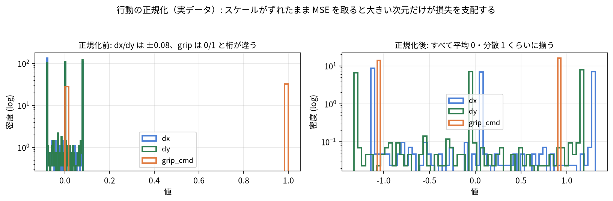
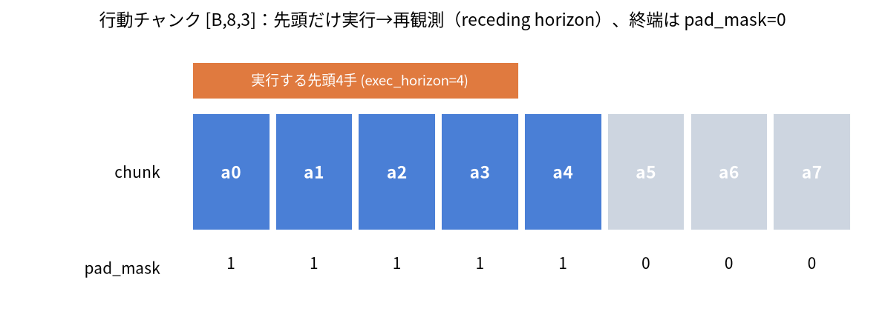

# M3: 行動表現とデータ（normalization / action chunking / tokenizer）

> この章のゴール:
> - **正規化 (normalization)** をマスターする: `Normalizer.fit / normalize / denormalize`、
>   なぜ「平均 0・分散 1」が嬉しいのか、**逆正規化を推論で使う**理由。
> - **時間方向の窓**と**行動チャンク (action chunking)** を理解する:
>   `extract_action_chunk` と `pad_mask`、そして「**なぜまとめて予測するのか**」（pi0 / ACT / SmolVLA の発想）。
> - **文字トークナイザ (`CharTokenizer`)** で言語指示を ID 列に変換する（PAD=0、語順の話は軽く触れて M4 へ）。
> - 仕上げに `SyntheticVLADataset` が返す `dict` の**各 shape** を完全に把握し、
>   **LeRobot 風データ辞書**（`observation / action / task`）への伏線を張る。
>
> 前提: [M1](m1_pytorch.md)（テンソル・Dataset/DataLoader）、[M2](m2_imitation.md)（エキスパート・`generate_episodes`・素朴 BC）。
> 所要時間: 60〜90 分（CPU。重い学習はしません）。

---

## 0. なぜ「行動表現とデータ」を独立した章にするのか

[M2](m2_imitation.md) では「観測 → 行動」をそのまま回帰しました。でも本物の VLA を作るには、
**入力と出力の“整え方”** が成否を分けます。具体的には:

1. **正規化**: 行動 `[dx, dy, grip_cmd]` は次元ごとにスケールが違う（`dx,dy` は小さな差分、`grip` は 0/1）。
   生のまま学習すると不安定。
2. **行動チャンク**: 1 ステップずつ出すと推論回数が多く、行動もガタつく。**まとめて 8 ステップ**出すと滑らか。
3. **言語のトークン化**: 文字列のままではネットに入らない。**ID 列**に変換する。
4. **データ辞書の形 (shape)**: モデル・損失・評価が食い違わないよう、**1 サンプルの形**を固定する。

この章で 1〜4 を順に押さえれば、[M4](m4_tiny_vla_mse.md) は「部品を組むだけ」になります。

---

## 1. 正規化 (normalization)

実装は [`../src/vla_learn/datasets/normalization.py`](../src/vla_learn/datasets/normalization.py) の `Normalizer` です。
次元ごとに `(x - mean) / std` で標準化し、逆変換 `x * std + mean` も持ちます。NumPy / Torch 両対応です。

### 1.1 なぜ「平均 0・分散 1」が嬉しいのか

ニューラルネットの重み初期化や最適化（Adam など）は、**入力/出力が 0 付近で分散 1 くらい**のときに
最も素直に働きます。理由を 3 つだけ:

- **次元間のスケール差を消す**: `dx,dy`（例: ±0.08）と `grip`（0 or 1）が混在すると、
  MSE は大きい次元に引っ張られます。標準化すると各次元が同じ土俵に乗ります。
- **勾配が暴れにくい**: 入力が大きいと活性化が飽和したり勾配が発散したりします。
- **学習率を共有できる**: 全次元のスケールが揃うので、1 つの学習率で全部うまく回ります。



### 1.2 `fit / normalize / denormalize` を触る

```python
import numpy as np
from vla_learn.datasets import generate_episodes, Normalizer

eps = generate_episodes(n_episodes=200, seed=0)
actions = np.concatenate([ep["actions"] for ep in eps], axis=0)  # [sumT, 3]
print("生の行動 平均:", actions.mean(0), " 標準偏差:", actions.std(0))

norm = Normalizer.fit(actions)         # 各列(次元)の mean/std を推定
print("学習した mean:", norm.mean, " std:", norm.std)

a = actions[:3]                        # 適当に 3 サンプル [3,3]
z = norm.normalize(a)                  # 正規化（平均0・分散1の空間へ）
back = norm.denormalize(z)             # 逆正規化（元の空間へ）
print("正規化後:", z)
print("往復誤差(最大):", np.abs(back - a).max())   # ほぼ 0 になるはず
```

出力例（数値はぶれます）:

```text
生の行動 平均: [-0.004  0.004  0.532]  標準偏差: [0.065 0.064 0.499]
学習した mean: [-0.004  0.004  0.532]  std: [0.065 0.064 0.499]
正規化後: [[ 1.29 -0.89 -1.07] ...]
往復誤差(最大): 0.0
```

> ポイント: `grip` 次元は `mean≈0.53, std≈0.50` のように 0/1 の比率を反映します。
> `dx,dy` は平均ほぼ 0・標準偏差 0.06 程度。正規化でどの次元も「だいたい ±1〜2」に収まります。
> （往復誤差は float32 なので 0.0〜1e-7 程度。数学的には厳密に元へ戻ります。）

### 1.3 `std=0` の罠（実装が守ってくれる）

ある次元が常に同じ値だと `std=0` で **0 割り**になります。`Normalizer` は内部で防いでいます:

```python
# normalization.py より（抜粋）
self.std = np.where(self.std < eps, 1.0, self.std)  # 0 割り防止（eps=1e-6）
```

### 1.4 【最重要】逆正規化を「推論」で使う

ここが初心者のつまずきポイントです。流れを図にします:

```text
[学習時]
  生の行動 a ──normalize──▶ 正規化行動 z ──(教師)──▶ モデルは z を当てるよう学習
                                              損失 = MSE(モデル出力, z)

[推論時（閉ループ）]
  モデル出力 z_hat ──denormalize──▶ 生の行動 a_hat ──▶ env.step(a_hat) に渡す
                     ↑ これを忘れると、環境は ±2 みたいな巨大な dx,dy を受け取り破綻する
```

- **学習**は正規化空間（平均0・分散1）で行います（`dy` などの小さな差分を扱いやすくするため）。
- **推論**ではモデル出力を**必ず逆正規化**して、生のワールド座標差分に戻してから環境へ渡します。
- これを忘れると、環境は桁違いの行動を受け取り、即座にクリップされて全く動かない・暴れる、となります。

> リポジトリでもこの分担を守っています。学習は正規化済み行動を教師にし（`SyntheticVLADataset`、3 節）、
> 推論時は `PolicyWrapper` が逆正規化してから返します（[M4](m4_tiny_vla_mse.md) の `evaluation/rollout.py`）。
> 状態 `state` も同様に「学習入力は正規化、環境から来た生 state は推論時に正規化してから入れる」が基本です。

---

## 2. 時間方向の窓と行動チャンク (action chunking)

実装は [`../src/vla_learn/datasets/temporal.py`](../src/vla_learn/datasets/temporal.py) の
`extract_action_chunk` です。**ある時刻 `t` から `chunk_len` ステップ分の行動**をまとめて取り出します。

### 2.1 なぜ「まとめて」予測するのか

1 ステップずつ予測する素朴版（M2）には弱点がありました:

- **推論回数が多い**: 毎ステップ重いモデルを呼ぶ。実機では遅延になる。
- **行動がガタつく**: 各ステップ独立に予測すると、連続性が保証されず震えやすい。

そこで VLA の多くは「**これから `chunk_len`（例 8）ステップ分の行動**」を**1 回でまとめて**出します。
これを **行動チャンク (action chunking)** と呼びます。利点:

- **推論回数が減る**: 8 ステップ分を 1 回で出し、しばらくそれを実行できる（後述の exec_horizon）。
- **行動が滑らか**: 連続する複数ステップを一括設計するので、軌道が自然につながる。
- **時間的な一貫性**: 「掴んでから運ぶ」のような短い手順を、ひとまとまりで学べる。



> 座学とのつながり: ACT（Action Chunking with Transformers）、pi0、SmolVLA はいずれも
> 「**ひとまとまりの行動系列**」を生成します。本リポジトリの `chunk_len=8` はその最小版です。
> [M5](m5_flow_matching.md) では、このチャンクを **flow matching** で生成します
> （= `[B, chunk_len, action_dim]` のサンプルを生成モデルで作る）。

### 2.2 `extract_action_chunk` の中身と `pad_mask`

```python
# temporal.py（全文に近い抜粋）
def extract_action_chunk(actions, t, chunk_len):
    T, action_dim = actions.shape
    chunk = np.zeros((chunk_len, action_dim), dtype=np.float32)
    pad_mask = np.zeros((chunk_len,), dtype=np.float32)

    n_valid = min(chunk_len, T - t)
    chunk[:n_valid] = actions[t : t + n_valid]
    pad_mask[:n_valid] = 1.0
    if n_valid < chunk_len:
        chunk[n_valid:] = actions[T - 1]  # 最後の行動で埋める（静止に近く無害）
    return chunk, pad_mask
```

ポイント:

- 戻り値は `chunk: [chunk_len, action_dim]` と `pad_mask: [chunk_len]`。
- エピソード**終端付近**では `t + chunk_len` が `T` を超えます。足りない分は**最後の行動で埋め**、
  その位置の `pad_mask` を `0` にします（`1`＝有効ステップ、`0`＝パディング）。
- `pad_mask` は損失計算で「**パディングは数えない**」ために使います（次節 5 と
  [`../src/vla_learn/functional.py`](../src/vla_learn/functional.py) の `masked_mse`）。

### 2.3 図で見る窓とパディング

`chunk_len=4`、エピソード長 `T=6` の例:

```text
actions:  a0 a1 a2 a3 a4 a5            (T=6, 各 a は [dx,dy,grip])
                                       chunk_len=4 の窓を t ごとにスライド

t=0 → chunk=[a0 a1 a2 a3]  pad_mask=[1 1 1 1]   (全部有効)
t=1 → chunk=[a1 a2 a3 a4]  pad_mask=[1 1 1 1]
t=2 → chunk=[a2 a3 a4 a5]  pad_mask=[1 1 1 1]
t=3 → chunk=[a3 a4 a5 a5]  pad_mask=[1 1 1 0]   ← 末尾 a5 を複製、最後はパディング
t=4 → chunk=[a4 a5 a5 a5]  pad_mask=[1 1 0 0]
t=5 → chunk=[a5 a5 a5 a5]  pad_mask=[1 0 0 0]
       └ 有効 ┘└ padding ┘
```

実際に動かして shape と中身を確かめましょう:

```python
import numpy as np
from vla_learn.datasets import extract_action_chunk

actions = np.arange(6 * 3, dtype=np.float32).reshape(6, 3)  # [T=6, 3] わかりやすい連番
for t in (0, 3, 5):
    chunk, pad_mask = extract_action_chunk(actions, t, chunk_len=4)
    print(f"t={t}  chunk.shape={chunk.shape}  pad_mask={pad_mask}")
    print(chunk)
```

出力例:

```text
t=0  chunk.shape=(4, 3)  pad_mask=[1. 1. 1. 1.]
[[ 0.  1.  2.] [ 3.  4.  5.] [ 6.  7.  8.] [ 9. 10. 11.]]
t=3  chunk.shape=(4, 3)  pad_mask=[1. 1. 1. 0.]
[[ 9. 10. 11.] [12. 13. 14.] [15. 16. 17.] [15. 16. 17.]]
t=5  chunk.shape=(4, 3)  pad_mask=[1. 0. 0. 0.]
[[15. 16. 17.] [15. 16. 17.] [15. 16. 17.] [15. 16. 17.]]
```

---

## 3. 言語のトークン化 (`CharTokenizer`)

実装は [`../src/vla_learn/datasets/tokenizer.py`](../src/vla_learn/datasets/tokenizer.py) です。
本物の VLA は BERT/Llama のサブワード・トークナイザを使いますが、ここでは**文字を ID に変換するだけ**の
最小実装にします（日本語でも空白に依存せず動きます）。

要点:

- **`PAD = 0`**（埋め草）。語彙の index 0 を PAD に固定しています。
- 語彙は**ありうる指示文すべて**から作るので、未知語 (OOV) は出ません
  （`all_instruction_strings()` で全パターンを列挙 → `from_corpus`）。
- `encode(text)` は**長さ `max_len` 固定**の ID 列を返します（不足は PAD、超過は切り詰め）。

```python
from vla_learn.envs import all_instruction_strings
from vla_learn.datasets import CharTokenizer

corpus = all_instruction_strings()                 # ありうる全指示文
tok = CharTokenizer.from_corpus(corpus)            # max_len は corpus 最長に自動設定
print("語彙サイズ vocab_size:", tok.vocab_size)
print("max_len:", tok.max_len)

s = "青のブロックを青のゴールに置いて"
ids = tok.encode(s)
print("文字数:", len(s), "  ids 長さ:", len(ids))   # ids 長さは常に max_len
print("ids[:12]:", ids[:12])
print("PAD は 0 で末尾を埋める:", ids[-5:])
print("復元:", tok.decode(ids))                     # PAD(0) を除いて元に戻る
```

出力例（語彙サイズは色名・テンプレ依存。ぶれます）:

```text
語彙サイズ vocab_size: 30
max_len: 17
文字数: 16   ids 長さ: 17
ids[:12]: [28, 8, 18, 21, 17, 15, 11, 28, 8, 16, 22, 20]
PAD は 0 で末尾を埋める: [7, 25, 1, 5, 0]
復元: 青のブロックを青のゴールに置いて
```

> （`max_len=17` ＝ コーパス中で最長の指示文の文字数。上の指示文は 16 文字なので、末尾に PAD が 1 つ付いて 17 になります。
> もっと短い指示文なら PAD はさらに増えます。`vocab_size` は使われる文字種の数 + PAD で、テンプレート・色名により変わります。）

> 語順の話（軽く）: いまの `encode` は ID の**並び**を保ちます。これを後で
> 「単純な平均プーリング」で潰すと、**「赤を青ゴールへ」と「青を赤ゴールへ」が同じベクトル**になり、
> どの色をどこへ運ぶか（grounding）を区別できなくなります。
> だから [M4](m4_tiny_vla_mse.md) の `TextEncoder` は**位置埋め込み + Transformer** で**語順を区別**します。
> ここでは「ID 列には順序情報がある」とだけ覚えておけば十分です。

---

## 4. すべてを束ねる `SyntheticVLADataset`

ここまでの 1〜3（正規化・チャンク・トークン化）と、M2 の「state→image レンダリング」を**1 つの Dataset**に
まとめたのが [`../src/vla_learn/datasets/synthetic_dataset.py`](../src/vla_learn/datasets/synthetic_dataset.py) の
`SyntheticVLADataset` です。`__getitem__` が返す **1 サンプルの dict と shape** を完全に把握しましょう。

```python
import torch
from torch.utils.data import DataLoader
from vla_learn.envs import all_instruction_strings
from vla_learn.datasets import (
    generate_episodes, build_normalizers, SyntheticVLADataset, CharTokenizer,
)

eps = generate_episodes(n_episodes=50, seed=0)
tok = CharTokenizer.from_corpus(all_instruction_strings())
action_norm, state_norm = build_normalizers(eps)        # 行動・状態の Normalizer を一括作成
ds = SyntheticVLADataset(eps, tok, chunk_len=8,
                         action_normalizer=action_norm,
                         state_normalizer=state_norm)

sample = ds[0]
for k, v in sample.items():
    print(f"{k:10s} shape={tuple(v.shape)}  dtype={v.dtype}")
```

出力例:

```text
image      shape=(3, 64, 64)  dtype=torch.float32
state      shape=(3,)         dtype=torch.float32
tokens     shape=(17,)        dtype=torch.int64
action     shape=(8, 3)       dtype=torch.float32
pad_mask   shape=(8,)         dtype=torch.float32
```

`__getitem__` の各項目の意味（[M0](m0_overview.md) の観測・行動の定義に対応）:

| キー | shape | dtype | 中身 | どこから |
|------|-------|-------|------|----------|
| `image` | `[3, 64, 64]` | float32 | 視覚入力（その時刻の世界を描画） | `render_world`（都度レンダリング） |
| `state` | `[3]` | float32 | 固有受容状態 `[ax, ay, gripper]`（**正規化済み**） | `state_normalizer.normalize` |
| `tokens` | `[max_len]` | int64 | 言語指示の文字 ID 列（文字を先頭から並べ、不足分は末尾を PAD=0 で埋める＝右パディング） | `tokenizer.encode` |
| `action` | `[8, 3]` | float32 | 行動チャンク（**正規化済み**） | `extract_action_chunk` → `action_normalizer.normalize` |
| `pad_mask` | `[8]` | float32 | 1=有効 / 0=パディング | `extract_action_chunk` |

> なぜ `image` だけ保存せず都度レンダリングするのか: 画像を全部ディスクに置くとギガ単位になります。
> そこで**低次元の状態だけ保存**し、`__getitem__` で `state → image` を描画します（`save_dataset/load_dataset`）。
> 「状態 → 画像」のパイプライン自体も VLA の学びです（[M2](m2_imitation.md) の `render_world` と同じ仕組み）。

### 4.1 DataLoader でバッチにすると先頭に `B` が付く

`DataLoader` は同じ形のサンプルを `batch_size` 個積み、**各テンソルの先頭に次元 `B`** を足します。
これが M4 でモデルに渡る形です。手を動かして確認しましょう（これは演習でも問います）。

```python
batch = next(iter(DataLoader(ds, batch_size=4, shuffle=True)))
for k, v in batch.items():
    print(f"{k:10s} {tuple(v.shape)}")
```

出力例:

```text
image      (4, 3, 64, 64)
state      (4, 3)
tokens     (4, 17)
action     (4, 8, 3)
pad_mask   (4, 8)
```

覚え方:

- 画像は `[B, C, H, W]`（チャンネル先頭）。
- 行動チャンクは `[B, T, A]`（T=chunk_len=8, A=action_dim=3）。
- ベクトル系（state）は `[B, D]`。

---

## 5. 仕上げ: `pad_mask` を使った損失 `masked_mse`

行動チャンクの末尾はパディングで埋まっているので、そのまま MSE を取ると
**存在しないステップ**まで誤差に数えてしまいます。
[`../src/vla_learn/functional.py`](../src/vla_learn/functional.py) の `masked_mse` は `pad_mask=0` を除外します:

```python
# functional.py（全文に近い抜粋）
def masked_mse(pred, target, mask=None):     # pred,target: [B,C,A]  mask: [B,C]
    se = (pred - target) ** 2                # [B, C, A]
    if mask is None:
        return se.mean()
    mask3 = mask.unsqueeze(-1).expand_as(se) # [B, C, A] に拡張
    return (se * mask3).sum() / mask3.sum().clamp(min=1.0)
```

「マスクで割る」ところが肝です。**有効ステップ数で平均**するので、パディングの多寡で
損失のスケールが変わりません。実際に確かめます:

```python
import torch
from vla_learn.functional import masked_mse

pred   = torch.zeros(2, 4, 3)
target = torch.ones(2, 4, 3)
mask   = torch.tensor([[1., 1., 1., 0.],     # 4ステップ中3つ有効
                       [1., 1., 0., 0.]])    # 2つ有効
print("マスク無し:", masked_mse(pred, target).item())        # 全要素の平均 = 1.0
print("マスク有り:", masked_mse(pred, target, mask).item())  # 有効分だけ = やはり 1.0
# 値は同じ 1.0 だが、分母が「全要素」か「有効要素」かが違う点が重要
```

出力例:

```text
マスク無し: 1.0
マスク有り: 1.0
```

> この例はどちらも `1.0` ですが、**予測がパディング位置で大きく外れている**場合に差が出ます。
> パディングを数えないことで、「実在するステップの再現」だけを正しく評価できます（演習で確認します）。
> [M5](m5_flow_matching.md) の flow 損失でも、同じ `pad_mask` でパディングを除外します。

---

## 6. LeRobot 風データ辞書への伏線

この章で作った `dict`（`image / state / tokens / action / pad_mask`）は、本リポジトリ内部の形式です。
[M6](m6_lerobot_and_models.md) では、これを **LeRobot 風のデータ辞書**へ対応づけます。ざっくり:

```text
本教材の内部 dict           LeRobot 風（概念対応）
  image            ─────▶   observation.image     （視覚）
  state            ─────▶   observation.state     （固有受容）
  instruction/tokens ───▶   task                  （言語指示。LeRobot は文字列で持つことが多い）
  action (chunk)   ─────▶   action                （行動。フレーム列として保存）
```

LeRobot ではエピソードを**フレーム列**（各時刻の `observation / action / task` のレコード）として保存します。
本教材の `map_episode_to_frames`（[M6](m6_lerobot_and_models.md) の `export_lerobot.py`、lerobot 無しでも動く）が
この変換の入口です。**いまは「内部 dict と LeRobot 辞書は名前が違うだけで中身は対応する」**と覚えておけば十分です。

> 設計思想: SmolVLA など LeRobot 直結の VLA も、入力は「画像 + 状態 + 言語(task)」、出力は「action」です。
> 本教材の dict はその**最小縮小版**。だから M4/M5 で TinyVLA/FlowVLA を作れば、
> M6 で SmolVLA を「同じ部品の大規模版」として読めます。

---

## 7. まとめ

- **正規化**: `Normalizer.fit/normalize/denormalize`。学習は正規化空間、**推論は逆正規化して環境へ**（最重要）。
  `std=0` は実装が 0 割り防止。
- **行動チャンク**: `extract_action_chunk(actions, t, chunk_len) → (chunk[C,A], pad_mask[C])`。
  終端は最後の行動で**パディング**し `pad_mask=0`。まとめて出す理由＝**推論回数減・滑らかさ・一貫性**（pi0/ACT/SmolVLA）。
- **トークナイザ**: `CharTokenizer`（文字→ID、`PAD=0`、OOV なし、長さ `max_len` 固定）。ID 列は**語順**を保つ。
- **`SyntheticVLADataset`** の 1 サンプル: `image[3,64,64] / state[3] / tokens[L] / action[8,3] / pad_mask[8]`。
  DataLoader で先頭に `B` が付く。
- **`masked_mse`** は `pad_mask` でパディングを除外して**有効ステップで平均**する。
- これらは **LeRobot 風辞書**（`observation / action / task`）の最小版で、M6 で対応づける。

## 次の章へ

データの作法が揃いました。次の [M4](m4_tiny_vla_mse.md) では、いよいよ
`画像 + 言語 + 状態 → 行動チャンク` を出す **TinyVLA**（MSE 回帰版）をスクラッチで組み、
`masked_mse` で学習し、**閉ループで成功率を測る**ところまで行きます。
この章の `SyntheticVLADataset` がそのまま学習データになります。

→ 演習は [`../exercises/m3/README.md`](../exercises/m3/README.md)、解答は [`../solutions/m3/README.md`](../solutions/m3/README.md)。
