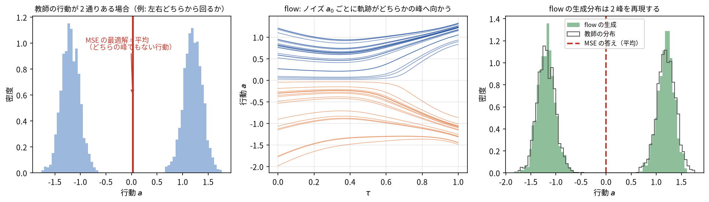
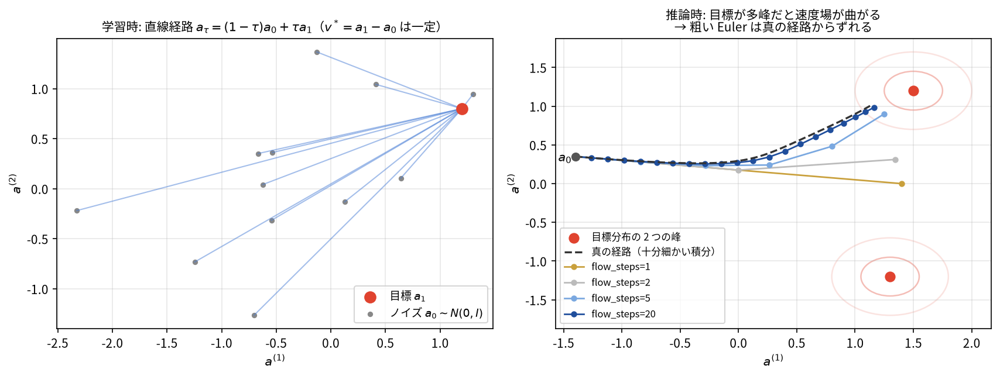

# M5: flow matching 化（MSE ヘッド → rectified flow ヘッド）

> この章のゴール:
> - [M4](m4_tiny_vla_mse.md) の `TinyVLA`（MSE 回帰版）の **行動ヘッドだけ** を rectified flow
>   （= linear flow）に差し替え、`FlowVLA` を自作・学習・評価する。
> - **なぜ MSE では足りないのか**（多峰性 (multimodality) を平均で潰す問題）を具体例で腹落ちさせる
>   （本タスク自体は、あえて多峰性が出ないよう単純化してある点も明示します）。
> - 既習の **拡散 / フローの座学**（スコア・ノイズ除去・確率フロー）を、**実装の数行に回収**する。
> - **時刻埋め込み (`SinusoidalTimeEmbedding`)** と **速度ネット (velocity net)** の役割・入出力 shape を押さえる。
> - 推論の **Euler 積分**（`τ=0→1`, `flow_steps`）を実装し、`flow_steps` を変えると何が変わるかを実験する。
>
> 前提: [M4](m4_tiny_vla_mse.md)（`VLABackbone` / FiLM / 行動チャンク / 閉ループ評価）、
> [M3](m3_data_actions.md)（正規化・`pad_mask`・`masked_mse`）、[M1](m1_pytorch.md)（学習ループ・autograd）。
> diffusion / flow の **座学（数式・概念）は理解済み** という前提で書きます。概念の再講義はしません。
> 所要時間: 90〜150 分（CPU。**重い学習は写経しなくても読めるよう**に構成。実行するなら数分かかります）。

実装本体: [`../src/vla_learn/models/flow_head.py`](../src/vla_learn/models/flow_head.py)

**この章の流れ**: 足すのは 1 点だけ（ヘッド差し替え）→ なぜ MSE では不十分か（多峰性）→
rectified flow の実装対応（flow_loss）→ 時刻埋め込みと速度ネット → Euler 積分（sample / flow_steps）→
学習と評価 → 本物の VLA とのつながり → 章末チェック

> **思い出し（1 分）**: **スコア関数** = `∇_a log p(a)`（分布の対数密度の勾配場）。
> **確率フロー ODE** = 拡散過程と同じ周辺分布をたどる決定論的な流れ。**flow matching** はこの
> 「流れ（速度場）」を、スコアを経由せず**直接回帰で**学ぶ手法 — と押さえていれば本章は読めます。
> 1 年前に学んだ人はここだけ思い出してください。

---

## 0. この章で「足す」のは 1 点だけ

[M4](m4_tiny_vla_mse.md) で作った VLA は、こうでした:

```
image ─▶ ImageEncoder ─┐
tokens ▶ TextEncoder ──┼─▶ concat ─▶ Fusion MLP ─▶ h ─▶ [行動ヘッド] ─▶ 行動チャンク
state ─▶ StateEncoder ─┘                          (条件ベクトル h: [B, hidden])
```

M5 で変えるのは **右端の `[行動ヘッド]` だけ** です。左側のエンコーダ（FiLM 付き `VLABackbone`）は
**一字も変えずそのまま共有** します。

| | 行動ヘッド | 学習の損失 | エンコーダ（`VLABackbone`） |
|---|---|---|---|
| M4 `TinyVLA` | `nn.Linear(hidden, C*A)`（決定論的に 1 点を出す） | `masked_mse(pred, action)` | 共有（FiLM・Transformer・flatten） |
| M5 `FlowVLA` | **速度ネット** `v(a_τ, τ, h)` | **flow matching loss** | **同じものを共有** |

なぜこの設計が嬉しいか。**「観測をどう理解するか（perception）」と「行動をどう生成するか（action head）」を
分離**しているからです。grounding（言語で対象を選ぶ）の作り込みは M4 で済んでいて、M5 はその上に
「平均で潰さない行動生成」を **載せ替えるだけ** で得られます。これはおもちゃの話ではなく、
π0 / SmolVLA が現に取っている構造です（→ [6 節](#6-本物の-vla-とのつながり次章-m6-へ)）。

> 既習の座学との対応（先に結論）: M4 の MSE は「条件付き平均 `E[a|h]` を点推定する」回帰。
> M5 の flow matching は「条件付き分布 `p(a|h)` から **サンプリング** できる生成モデル」を作ります。
> 拡散の「ノイズから画像を生成」を、ここでは「ノイズから **行動チャンク** を生成」に使うだけです。
>
> なお「ヘッドだけ差し替え」と言っても、`FlowVLA` には**時刻埋め込み**と**速度ネット `vnet`**（3 層 MLP）が
> 新たに加わるため、パラメータ数は `TinyVLA` の約 0.42M → 約 0.58M に増えます（エンコーダ部は共有）。

---

## 1. なぜ MSE では不十分か（多峰性を平均で潰す）

### 1.1 多峰性とは（なぜ MSE は平均で潰れるのか）

`masked_mse` は出力を **教師の平均** に近づけます。教師（エキスパート）の行動が
**1 つの局面に対して複数あり得る**（＝多峰）とき、平均は「どれでもない中間」になります。
一般のロボットタスクでは、この多峰性が頻繁に起きます:

```
        ● ゴール
        │
    ┌───┴───┐     エージェントは今ここ ▲ にいて、障害物（■）を
    │       │     避けてゴールへ向かう。左から回っても右から回っても
   左回り   右回り   到達できる ＝ 正解の行動が 2 つ（2 峰）ある。
    │       │
    └───▲───┘
        ■ 障害
```

- データに「左に回る軌跡」と「右に回る軌跡」の **両方** が（別エピソードとして）入ると、
- ある瞬間の状態 `h` に対し、教師行動は `dx<0`（左）と `dx>0`（右）の **2 つの峰** を持つ。
- MSE は両者を 1 点で当てようとして、その **平均 `dx≈0`（まっすぐ突っ込む）** を学ぶ。
  これは**どちらの正解でもなく**、障害に当たる最悪手です。

「掴むか／もう一歩寄ってから掴むか」「複数の対象のどれを先に運ぶか」でも同じ多峰が起きます。
π0 / SmolVLA など実用 VLA が flow / diffusion を使う最大の理由がこれです。

> **⚠ ただし本教材のタスクは、あえて多峰性が出ないよう単純化してあります。**
> 現行の `Tabletop2DEnv` には障害物も衝突判定もなく、エキスパート（[`expert.py`](../src/vla_learn/envs/expert.py)）は
> 対象へ **まっすぐ近づく決定論方策**（経路の分岐も障害物回避もなく、各軸を `MAX_STEP` でクリップしながら
> 対象→ゴールへ詰める）です。物体の色も重複しません（指示は一意）。つまり、ある状態
> `h` に対する正解行動はほぼ **1 つ（単峰）**。だからこそ M4 の MSE 版でも 7〜8 割動きました
> （失敗の主因は多峰性ではなく、[M2](m2_imitation.md) で見た **分布シフト** です）。
>
> ではなぜここで flow を学ぶのか。狙いは 2 つです。
> 1. **多峰を扱える行動ヘッドの作り方**を、最小実装で体得する（座学の flow matching を自分の手で動かす）。
> 2. **同じ backbone のまま MSE ヘッドを生成ヘッドに差し替えても性能が落ちない**
>    （むしろ閉ループがやや安定する）ことを確認する。
>
> flow の真価がはっきり出るのは **多峰タスク** で、本タスクはそこへ進む前の安全な足場です。
> 強い多峰での差を直接見たい人は、障害物入りの環境やトイ問題への拡張で観察できます。

### 1.2 数式で 1 行

回帰の最適解は条件付き平均です:

```
argmin_f E[ || f(h) - a ||^2 ]  =  f*(h) = E[a | h]   ← 平均（多峰だと谷の底）
```

flow matching が学ぶのは平均ではなく、**`p(a|h)` から実際にサンプルを引く手続き**です。
だから 2 峰なら、ある推論では左の峰、別の推論では右の峰、と **片方の正解を選べます**。

> 座学の言い換え: MSE は L2 回帰 ＝「ガウス 1 個でフィット」。多峰分布をガウス 1 個で表すと
> 平均に山が立ち、真の峰が消える。flow / diffusion は分布そのものを表現できる、という既習の話を、
> ここでは行動 `a` について行います。



---

## 2. rectified flow の実装対応（座学 → コード）

ここからが本題です。**座学で知っている rectified flow（= linear / conditional flow matching）が、
`flow_head.py` のどの行に化けるか** を、1 対 1 で対応させます。

### 2.1 まっすぐな道とその速度

ノイズ `a0 ~ N(0, I)` から目標行動 `a1`（正規化済みの教師チャンク）へ、**直線で結ぶ**道を引きます:

```
経路:  a_τ = (1 - τ) · a0 + τ · a1        （τ: 0 → 1）
速度:  v* = d a_τ / dτ = a1 - a0          （τ によらず一定！）
```

`τ=0` でノイズ `a0`、`τ=1` で目標 `a1`。直線なので速度は **始点と終点だけで決まる定数** `a1 - a0` です。
ネットワークの仕事は「**いま `a_τ` にいて時刻が `τ`、条件が `h` のとき、進むべき速度 `v` を答える**」こと:

```
損失:  L = || v_pred(a_τ, τ, h) - (a1 - a0) ||^2     （pad は masked_mse で除外）
```



> 図の右パネルに注意: **教師にする経路は直線**でも、ネットが学ぶのは「その点に居合わせた経路の平均速度」
> なので、目標が 2 峰だと**推論時の場は途中で曲がります**。`flow_steps=1` は峰の間の「どちらでもない」
> 場所に落ち、刻みを増やすほど真の経路（破線）に近づきます（4.1 節で詳述）。

### 2.2 `flow_loss` の 8 行と座学の対応

実装（[`flow_head.py`](../src/vla_learn/models/flow_head.py) の `FlowVLA.flow_loss`）はこれだけです:

```python
def flow_loss(self, image, state, tokens, action, pad_mask=None):
    h = self.encode(image, state, tokens)         # [B, hidden]  ← M4 と同じ backbone
    a1 = action                                   # [B, C, A]    正規化済みの目標チャンク
    a0 = torch.randn_like(a1)                      # [B, C, A]    ノイズ（標準正規）
    tau = torch.rand(a1.shape[0], device=a1.device)            # [B]  ~ U(0, 1)
    a_tau = (1 - tau)[:, None, None] * a0 + tau[:, None, None] * a1   # [B, C, A] 経路上の点
    v_pred = self.velocity(a_tau, tau, h)          # [B, C, A]   ネットの予測速度
    v_target = a1 - a0                             # [B, C, A]   真の速度（一定）
    return masked_mse(v_pred, v_target, pad_mask)  # スカラ
```

座学の各概念がどの行か:

| 座学の概念 | コード | 補足 |
|---|---|---|
| ノイズ分布 `p0 = N(0,I)` | `a0 = torch.randn_like(a1)` | 行動チャンクと同じ shape のノイズ |
| データ分布 `p1`（目標） | `a1 = action` | 正規化済み教師（[M3](m3_data_actions.md)） |
| 時刻サンプル `τ ~ U(0,1)` | `tau = torch.rand(B)` | バッチ内の各サンプルに別々の `τ` |
| 補間（確率パス）`a_τ` | `a_tau = (1-τ)·a0 + τ·a1` | **直線**パス（= rectified） |
| 真の速度場 `v*=a1-a0` | `v_target = a1 - a0` | 直線なので閉形式・一定 |
| 速度のマッチング損失 | `masked_mse(v_pred, v_target, pad_mask)` | L2 で速度を回す |

> **拡散座学（スコア / ノイズ除去）との対応**（ここを 1 段落で）:
> 拡散モデルでは「ノイズを加えた `x_t` から、加えたノイズ ε（または スコア `∇log p`）を予測」しました。
> rectified flow は、その「ノイズ予測」を「**確率フロー ODE の速度場 `v` 予測**」に置き換えた形です。
> 直線パスを使うと速度は `a1 - a0` という定数になり、拡散の複雑なノイズスケジュールも、
> スコアからサンプラへの変換も要りません。**`v = a1 - a0` を L2 で当てるだけ** で生成器が手に入る
> ——これが「rectified（まっすぐにした）flow」が実装上うれしい理由で、座学の確率フロー ODE の
> 最小実装そのものです。pad の除外に `masked_mse` を使うのは [M3](m3_data_actions.md) と同じ作法です。

### 2.3 `[:, None, None]` が要る理由（つまずきの定番）

`tau` は `[B]`、`a0` / `a1` は `[B, C, A]`（3 次元）です。`tau * a0` を素直に書くと
**形が合わず**ブロードキャストに失敗します（または意図しない次元で勝手に合ってしまう）。
`tau[:, None, None]` で `[B, 1, 1]` に整形すると、`C` と `A` の両方向へ正しく放送され、
**サンプルごとに 1 つの `τ`** がチャンク全体へ効きます。

```python
tau            # [B]
tau[:, None]   # [B, 1]
tau[:, None, None]   # [B, 1, 1]  ← これで [B, C, A] と掛けられる
```

> これは演習 M5 の「バグ修正」に出します。`[:, None, None]` を忘れると、形エラーか、
> バッチとチャンクが混線した無意味な `a_τ` になります。

---

## 3. 時刻埋め込みと速度ネット（shape を完全に追う）

### 3.1 `SinusoidalTimeEmbedding`：連続時刻をベクトルに

速度ネットは MLP（全結合）です。MLP に「`τ=0.3`」という生のスカラ 1 個を入れても、
時刻の情報をうまく使えません。そこで `τ` を **高次元ベクトル** に展開してから渡します。
発想は Transformer の位置符号（[M4](m4_tiny_vla_mse.md) の `TextEncoder` で出た正弦波）と**同じ**で、
違うのは「離散の位置 `pos=0,1,2,…`」ではなく「**連続の時刻 `τ∈[0,1]`**」を符号化する点だけです。

```python
class SinusoidalTimeEmbedding(nn.Module):
    def __init__(self, dim=64):
        super().__init__()
        assert dim % 2 == 0
        self.dim = dim

    def forward(self, tau):                 # tau: [B]
        half = self.dim // 2
        freqs = torch.exp(-math.log(1000.0) * torch.arange(half, device=tau.device) / (half - 1))  # [half]
        ang = tau[:, None] * freqs[None, :] * (2 * math.pi)   # [B, half]
        return torch.cat([torch.sin(ang), torch.cos(ang)], dim=-1)  # [B, dim]
```

役割: いろいろな周波数の `sin/cos` で `τ` を表すと、**近い時刻は近いベクトル、別の時刻は区別できる**
表現になります。これで速度ネットは「`τ` の前半（ノイズ寄り）か後半（目標寄り）か」を読み取れます。

shape: 入力 `tau` は `[B]` → 出力 `[B, time_dim]`（既定 `time_dim=64`）。`dim` が偶数なのは
`sin` 半分・`cos` 半分を `cat` するためです。

### 3.2 `velocity`：速度ネットの入出力

速度ネットは「**いまの行動 `a_τ` ・時刻 `τ` ・条件 `h`** を 1 本のベクトルに連結して MLP に通す」だけです:

```python
def velocity(self, a, tau, h):              # a:[B,C,A], tau:[B], h:[B,hidden] → [B,C,A]
    B = a.shape[0]
    x = torch.cat([a.flatten(1), h, self.time_embed(tau)], dim=-1)
    return self.vnet(x).view(B, self.chunk_len, self.action_dim)
```

連結する 3 つの shape（C=8, A=3, hidden=256, time_dim=64 の既定値で）:

| 部品 | 中身 | shape | 要素数 |
|---|---|---|---|
| `a.flatten(1)` | いまの行動チャンクを平らに | `[B, C*A]` | 8×3 = 24 |
| `h` | 観測の条件ベクトル（backbone 出力） | `[B, hidden]` | 256 |
| `self.time_embed(tau)` | 時刻埋め込み | `[B, time_dim]` | 64 |
| **`x`（連結後）** | 速度ネットへの入力 | `[B, in_dim]` | **24+256+64 = 344** |

`self.vnet` の構造（`__init__` 内）:

```python
in_dim = chunk_len * action_dim + hidden + time_dim     # 24 + 256 + 64 = 344
self.vnet = nn.Sequential(
    nn.Linear(in_dim, velocity_hidden), nn.ReLU(inplace=True),       # 344 -> 256
    nn.Linear(velocity_hidden, velocity_hidden), nn.ReLU(inplace=True),  # 256 -> 256
    nn.Linear(velocity_hidden, chunk_len * action_dim),              # 256 -> 24
)
```

出力 `[B, 24]` を `.view(B, 8, 3)` で **行動チャンクと同じ形** `[B, C, A]` に戻します。
つまり速度ネットは「行動空間の点 `a_τ`」を入れて「同じ行動空間の速度 `v`」を返す写像です。

> ここを手で言い当てる問題を演習 Q1〜Q3 に置きます。`in_dim=344`、`time_emb=[B,64]`、
> 出力 `[B,8,3]` がスラスラ出れば実装は読めています。

---

## 4. 推論：`τ=0→1` を Euler 積分してサンプルする

学習は「速度を当てる」だけでした。生成（推論）は、その速度場に沿って **ノイズから目標まで歩く** ことです。
直線パスの速度場を、`a0~N(0,I)` から `τ=0→1` へ **小さな前進（オイラー法）** で積分します:

```python
@torch.no_grad()
def sample(self, image, state, tokens, n_steps=10):
    self.eval()
    h = self.encode(image, state, tokens)              # [B, hidden]
    B = h.shape[0]
    a = torch.randn(B, self.chunk_len, self.action_dim, device=h.device)  # a0 ~ N(0,I)
    dt = 1.0 / n_steps
    for i in range(n_steps):
        tau = torch.full((B,), i * dt, device=h.device)   # 現在時刻 τ = i/n_steps
        a = a + self.velocity(a, tau, h) * dt              # オイラー前進: a ← a + v·dt
    return a                                               # [B, C, A]（正規化空間）
```

読み方:

- `a` を `τ=0` のノイズで初期化し、`dt = 1/n_steps` 刻みで `n_steps` 回進めます。
- 各ステップで「今の `a`・今の `τ`・条件 `h`」から速度を引き、`a ← a + v·dt` で前へ。
- ループ終了時、`a` は `τ=1` 近傍 ＝ **目標分布からのサンプル**（正規化空間の行動チャンク）。
- `@torch.no_grad()` と `self.eval()` で、推論中は勾配を作らず評価モードにします（[M1](m1_pytorch.md)）。

戻り値は **正規化空間** なので、環境に渡す前に `action_norm.denormalize(...)` で生の `[dx,dy,grip]` に
戻します。これは `PolicyWrapper`（[`rollout.py`](../src/vla_learn/evaluation/rollout.py)）がやってくれます:

```python
# rollout.py（抜粋）: flow と mse でここだけ分岐
if self.model_type == "flow":
    a = self.model.sample(img, state, tokens, n_steps=self.flow_steps)  # [1,C,3]
else:
    a = self.model(img, state, tokens)                                  # [1,C,3]
a = self.action_norm.denormalize(a)[0].cpu().numpy()                    # 生の行動へ
```

### 4.1 `flow_steps` は「生成の刻みの細かさ」

`n_steps`（= `flow_steps`）は **積分ステップ数** です。多いほど積分誤差が減りますが、
その分 **推論が重く** なります（速度ネットを `n_steps` 回呼ぶ）。刻み数が効く理由は 2 つ:

1. **教師にした path は直線でも、学習後の速度場は直線とは限らない**。ネットが学ぶのは「その点に
   居合わせた経路の平均速度」なので、目標が多峰（や広がりあり）だと **完璧に学習できても場は曲がります**
   （上の図の右パネル）。曲がった場を粗い Euler で辿るとずれます。
2. 学習した速度場は **近似** なので、その誤差も積分で拾います。

逆に、本タスクのように教師がほぼ決定論（目標がほぼ 1 点）なら理想の場はほぼ直線で、少ないステップでも
それなりに当たります。**`flow_steps=1/5/10/50` を変えて成功率・生成の質を比べる**実験を
演習 Q7 で行います（予告）。直感:

- `flow_steps=1`: いきなり `a0 + v·1` で 1 歩。粗い。多峰でも 1 歩で飛ぶ。
- `flow_steps=10`（既定）: 実用的な刻み。`m5_flow.json` の値。
- `flow_steps=50`: なめらかだが遅い。改善が頭打ちになりやすい。

---

## 5. 学習と評価（M4 との差分は本当に 2 箇所だけ）

### 5.1 trainer は MSE と共有、分岐は `_compute_loss` と「モデル構築」のみ

[`trainer.py`](../src/vla_learn/training/trainer.py) は **MSE / flow で同じファイル** です。違うのは 2 箇所:

**(1) モデル構築**（`run_training` 内）:

```python
model = (FlowVLA if cfg.model_type == "flow" else TinyVLA)(**model_kwargs).to(device)
```

**(2) 損失計算**（`_compute_loss`）:

```python
def _compute_loss(model, model_type, batch):
    if model_type == "flow":
        return model.flow_loss(
            batch["image"], batch["state"], batch["tokens"], batch["action"], batch["pad_mask"]
        )
    pred = model(batch["image"], batch["state"], batch["tokens"])  # [B,C,A]
    return masked_mse(pred, batch["action"], batch["pad_mask"])
```

学習ループ本体（`zero_grad → backward → step`、Dataset/DataLoader、正規化、保存、閉ループ評価）は
**一字も変わりません**。「観測理解は共有し、行動ヘッドだけ差し替える」という設計が、
コードの差分にもそのまま現れています。

### 5.2 学習を回す

```bash
# 設定ファイルで（推奨）
uv run python scripts/train_flow.py --config configs/m5_flow.json

# 一部だけ上書きしたいとき（flow_steps や epochs を変える）
uv run python scripts/train_flow.py --config configs/m5_flow.json --flow-steps 5 --epochs 40
```

`configs/m5_flow.json` の主な中身:

```json
{
  "model_type": "flow",
  "n_episodes": 1500, "n_objects": 3, "n_goals": 2,
  "chunk_len": 8, "epochs": 40, "batch_size": 128, "lr": 0.001,
  "flow_steps": 10, "eval_episodes": 100, "exec_horizon": 4, "seed": 0,
  "out_dir": "checkpoints/flow"
}
```

学習ログのイメージ（**数値はぶれます。CPU で数分**。重い学習を写経する必要はありません）:

```text
[setup] device=cpu  model_type=flow
[model] flow | パラメータ数 = ...
[train] epoch   0  loss=...
[train] epoch  39  loss=...
[eval] success_rate=...  final_dist=...  steps=...
```

> **flow の loss は MSE と数字の意味が違います**。`flow_loss` は毎ステップ `τ` と `a0` を乱数で引くので、
> **同じバッチでも値が上下にゆれます**。「単調にきれいに下がる曲線」を期待せず、
> **数十〜数百ステップの移動平均**で「下がっているか」を見てください（[7 節](#7-章末-1-バッチ過学習-で健全性を確かめる)）。
> MSE の loss（教師との二乗誤差）と flow の loss（速度の二乗誤差）を**直接比較しても意味はありません**。

### 5.3 評価（`eval_policy.py`、`flow_steps`）

```bash
uv run python scripts/eval_policy.py --ckpt checkpoints/flow/policy.pt                 # 既定 flow_steps=10
uv run python scripts/eval_policy.py --ckpt checkpoints/flow/policy.pt --flow-steps 5  # 積分ステップを変えて比較
```

`PolicyWrapper` は `model_type="flow"` を見て `sample(..., n_steps=flow_steps)` を呼びます。
`--flow-steps` の既定は 10。`1` や `5` に変えると、Euler 積分の刻み数が変わります
（理想的な速度場なら 1 歩でも直線で着きますが、学習した **近似** 速度場では刻み数が効きます）。
評価指標（`success_rate` / `mean_final_distance` / `mean_steps`）は M4 と同じ意味です
（閉ループ：チャンク予測 → 先頭 `exec_horizon` ステップ実行 → 再観測、を繰り返す。[M4](m4_tiny_vla_mse.md) 参照）。

到達点の目安: M4 の MSE 版 `TinyVLA` が同条件で **閉ループ成功率およそ 7〜8 割**でした。
**FlowVLA は同条件で MSE 版と同等以上**で、ある検証では成功率ほぼ 10 割（`flow_steps=5/10` で 1.00、
`final_dist≈0.08`）が出ました。ただし、**この差を「多峰性を扱えるから」と単純に結論づけてはいけません**。
本タスクはほぼ単峰なので（→ [1.1 節](#11-多峰性とはなぜ-mse-は平均で潰れるのか)）、ここで観察できるのは
「同じ FiLM 付き backbone のまま行動ヘッドを生成版へ差し替えても **劣化せず、むしろ閉ループがやや安定する**」
という経験的事実です。値は環境・乱数・PC・`seed`・`flow_steps` で大きくぶれるので、断定せず複数 `seed` で
傾向を見て、手元の値を控えておきましょう（MSE と同等以上に動けばまず成功）。実用 VLA が flow を選ぶ
本来の理由（多峰性）が **差として顕在化するのは強い多峰タスク** で、本章はその仕組みを最小実装で
先取りした、という位置づけです。

---

## 6. 本物の VLA とのつながり（次章 M6 へ）

`FlowVLA` は **おもちゃではなく、π0 / SmolVLA の骨格の最小版**です。対応はこうです:

| 自作 `FlowVLA`（M5） | π0 / SmolVLA（[M6](m6_lerobot_and_models.md) で精読） |
|---|---|
| `VLABackbone`（小さな画像/言語/状態エンコーダ + FiLM） | 大規模 **VLM**（事前学習済み）+ state トークン |
| `velocity` ネット（小さな MLP） | **action expert**（条件付き flow/diffusion ヘッド、より大きい） |
| `flow_loss`（rectified flow, L2） | 同じ **flow matching** 損失（パス・損失の発想は同一） |
| `sample`（Euler 積分） | 同じく **ODE/サンプラで行動を生成** |
| 行動チャンク（`chunk_len=8`） | **action chunking**（まとめて予測、receding horizon 実行） |

つまり「flow matching + action chunking + (VLM で条件付け)」という **部品の組み合わせは同じ** で、
本物は各部品が大規模・事前学習済みになるだけ、という地図が描けます。M6 では SmolVLA を精読して
「この `velocity` が action expert に、この `h` が VLM 出力に対応する」と読み解きます。

---

## 7. 章末: 1 バッチ過学習 で健全性を確かめる

flow でも、まず **小さな 1 バッチを丸暗記できるか** を確認します（毎章必須のデバッグ）。
ただし注意点が 1 つ:

> flow の `flow_loss` は `τ` と `a0` を毎回ランダムに引くので、**1 バッチでも loss が上下に揺れます**。
> 「最終値が最初より十分小さいか」「移動平均が下がっているか」で判断し、**1 ステップごとの増減に一喜一憂しない**。

確認の骨子（詳しいコードは演習 Q8 / 解答に）:

```python
# fixed = 1 バッチを固定して取り、それだけを繰り返し学習する
losses = []
for step in range(800):
    loss = model.flow_loss(fixed["image"], fixed["state"], fixed["tokens"],
                           fixed["action"], fixed["pad_mask"])
    opt.zero_grad(); loss.backward(); opt.step()
    losses.append(loss.item())

import numpy as np
early = np.mean(losses[:50])     # 最初 50 ステップの平均
late  = np.mean(losses[-50:])    # 最後 50 ステップの平均
print(f"{early:.4f} -> {late:.4f}")   # late が十分小さくなるはず（揺れるので平均で見る）
```

`run_training` には `overfit_one_batch=True` のスイッチもあり、1 バッチを繰り返す学習を内蔵しています。
**下がる**＝ `encode → velocity → flow_loss → backward → step` の配線は正しい。
**下がらない**＝学習ループ側のバグ（`zero_grad` 忘れ、`[:, None, None]` 忘れ、`.train()` 忘れ、
正規化忘れ、mask の取り違え）を疑います。**揺れていても移動平均が下がっていれば正常**です。

---

## まとめ

- MSE は条件付き **平均** を点推定するため、**多峰の局面**（左右どちらでも回れる等）で平均（突っ込む）に潰れる。
- rectified flow は `a_τ=(1-τ)a0+τa1`、真の速度 `v*=a1-a0` を **L2 で当てる**だけ。座学の確率フロー ODE の最小実装。
- `SinusoidalTimeEmbedding` で連続時刻 `τ` をベクトル化し、`velocity` は `[a_flat, h, time_emb]`（`[B,344]`）→ `[B,8,3]`。
- 推論は `a0~N(0,I)` から `τ=0→1` を **Euler 積分**（`sample`, `flow_steps`）。`flow_steps` は精度↔速度のトレードオフ。
- **M4 との差分は「行動ヘッドと損失」だけ**。エンコーダ（FiLM 付き `VLABackbone`）は共有し、`trainer` の分岐も 2 箇所のみ。
- これは π0 / SmolVLA の骨格の最小版。M6 で「同じ部品の大規模版」として精読する。

## 次の章へ

- 手を動かす → [`../exercises/m5/README.md`](../exercises/m5/README.md)（shape 確認・穴埋め・`[:,None,None]` バグ・Euler `sample` 小実装・`flow_steps` 実験・1 バッチ過学習）。答え合わせは [`../solutions/m5/README.md`](../solutions/m5/README.md)。
- 次章 → [M6: LeRobot と有名 VLA](m6_lerobot_and_models.md)。自作データの LeRobot export、**SmolVLA 精読**（この章の `velocity` / `flow_loss` が action expert にどう対応するか）、π0 / GR00T / OpenVLA / MolmoAct の概観、卒業課題へ。
- つまずいたら → 速度場・Euler 積分が曖昧なら本章 [3](#3-時刻埋め込みと速度ネットshape-を完全に追う)〜[4](#4-推論τ01-を-euler-積分してサンプルする) 節、`pad_mask`/正規化は [M3](m3_data_actions.md)、学習ループ/autograd は [M1](m1_pytorch.md) へ。
